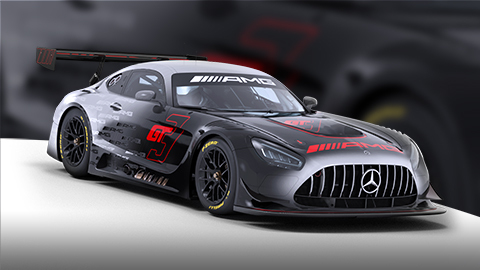
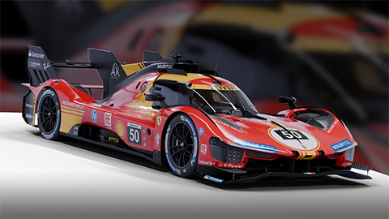

+++
title = "Car Selector"

[extra]
header = true
+++

    

    

    

        
 
            

                

                    <svg viewBox="0 0 16 16" focusable="false" class="icon"><path fill-rule="evenodd" clip-rule="evenodd" d="M12.8291 9H14V9.5C14 10.0523 14.4477 10.5 15 10.5C15.5523 10.5 16 10.0523 16 9.5V7C16 6.36868 15.7075 5.80568 15.2506 5.43913L14.4787 3.31651C14.1913 2.52614 13.4402 2 12.5991 2H9.40086C8.6779 2 8.02135 2.38879 7.66869 3H8.4914C9.09735 3 9.6701 3.18173 10.1497 3.5H12.5991C12.8094 3.5 12.9972 3.63153 13.069 3.82913L13.4948 5H11.3199C11.3403 5.05773 11.359 5.11636 11.376 5.17584L12.1593 7.91736C12.4537 8.22265 12.6844 8.59091 12.8291 9ZM14 6C14.2764 6 14.5 6.22363 14.5 6.5C14.5 6.66553 14.4194 6.8125 14.2954 6.90332C14.2129 6.96436 14.1108 7 14 7H13.3091C13.1196 7 12.9463 6.89307 12.8618 6.72363L12.5 6H14Z" fill="currentColor"></path><path fill-rule="evenodd" clip-rule="evenodd" d="M1.58555 5.45056L0.726299 8.45795C0.282676 8.82479 0 9.37939 0 10V13C0 13.5523 0.447715 14 1 14H1.5C2.05228 14 2.5 13.5523 2.5 13V12.5H9.5V13C9.5 13.5523 9.94771 14 10.5 14H11C11.5523 14 12 13.5523 12 13V10C12 9.37939 11.7173 8.82479 11.2737 8.45795L10.4144 5.45056C10.1691 4.59195 9.38436 4 8.4914 4H3.5086C2.61564 4 1.83087 4.59196 1.58555 5.45056ZM8.4914 5.5H3.5086C3.28536 5.5 3.08917 5.64799 3.02784 5.86264L2.41717 8H9.58283L8.97216 5.86264C8.91083 5.64799 8.71464 5.5 8.4914 5.5ZM2.5 10C2.5 9.87891 2.54297 9.76807 2.61426 9.68164C2.70605 9.57031 2.84473 9.5 3 9.5H4.5L4.13818 10.2236C4.09863 10.3027 4.04004 10.3682 3.96973 10.415C3.88867 10.4692 3.79199 10.5 3.69092 10.5H3C2.72363 10.5 2.5 10.2764 2.5 10ZM9.5 10C9.5 9.8877 9.46289 9.78369 9.40039 9.7002C9.30908 9.57861 9.16406 9.5 9 9.5H7.5L7.86182 10.2236C7.89697 10.2939 7.94727 10.3535 8.00781 10.3989C8.09277 10.4634 8.19824 10.5 8.30908 10.5H9C9.27637 10.5 9.5 10.2764 9.5 10Z" fill="currentColor"></path></svg>
                    
16 Cars Competing

                    <button onclick="exit_selecting()">
                        <svg style="transform: rotate(-180deg);" viewBox="0 0 16 16" focusable="false" class="icon"><path d="M8.00001 9.59999L2.70002 4.3C2.30002 3.9 1.7 3.9 1.3 4.3C0.9 4.7 0.9 5.30002 1.3 5.70002L7.3 11.7C7.7 12.1 8.30002 12.1 8.70002 11.7L14.7 5.70002C14.9 5.50002 15 5.20001 15 5.00001C15 4.80001 14.9 4.5 14.7 4.3C14.3 3.9 13.7 3.9 13.3 4.3L8.00001 9.59999Z" fill="currentColor"></path></svg>
                    </button>
                

            

            

            <input hidden="true" type="radio" name="car" id="dallarap217" value="0" checked />
            <label for="dallarap217" class="car" onclick="car_click()">
                

                    
                

                

                    <button class="fav">
                        <svg viewBox="0 0 16 16" focusable="false" class="icon"><path fill="currentColor" d="M8,1.3L8,1.3l1.4,4.4l0.2,0.7h0.7H15l-3.7,2.7l-0.6,0.4l0.2,0.7l1.4,4.4l-3.7-2.7L8,11.5l-0.6,0.4l-3.7,2.7l1.4-4.4l0.2-0.7 L4.7,9.1L1,6.4h4.6h0.7l0.2-0.7L8,1.3L8,1.3 M8,0.3C7.6,0.3,7.2,0.6,7,1L5.6,5.4H1c-0.4,0-0.8,0.3-1,0.7c-0.1,0.4,0,0.9,0.4,1.1 L4.2,10l-1.4,4.4c-0.1,0.4,0,0.9,0.4,1.1c0.2,0.1,0.4,0.2,0.6,0.2s0.4-0.1,0.6-0.2L8,12.8l3.7,2.7c0.2,0.1,0.4,0.2,0.6,0.2 c0.2,0,0.4-0.1,0.6-0.2c0.4-0.3,0.5-0.7,0.4-1.1L11.8,10l3.7-2.7C15.9,7,16.1,6.5,16,6.1c-0.1-0.4-0.5-0.7-1-0.7h-4.6L9,1 C8.8,0.6,8.4,0.3,8,0.3L8,0.3z"></path></svg>
                    </button>
                    
Dallara P217

                    
Dallara P217

                

            </label>
            <input hidden="true" type="radio" name="car" id="bmwm4gt3" value="1" />
            <label for="bmwm4gt3" class="car" onclick="car_click()">
                

                    
                

                

                    <button class="fav">
                        <svg viewBox="0 0 16 16" focusable="false" class="icon" aria-hidden="true"><path d="M1 1.25C0.585786 1.25 0.25 1.58579 0.25 2C0.25 2.41421 0.585786 2.75 1 2.75C1.28498 2.75 1.53951 2.92828 1.6369 3.1961L4.81642 11.9398C4.98083 12.3919 5.25561 12.7812 5.60373 13.0816C5.24856 13.235 5 13.5885 5 14C5 14.5523 5.44772 15 6 15C6.55228 15 7 14.5523 7 14C7 13.9007 6.98554 13.8048 6.9586 13.7143C7.1032 13.7378 7.25099 13.75 7.40085 13.75H12.0315C12.0109 13.8299 12 13.9137 12 14C12 14.5523 12.4477 15 13 15C13.5523 15 14 14.5523 14 14C14 13.718 13.8832 13.4632 13.6954 13.2814C13.7306 13.1945 13.75 13.0995 13.75 13C13.75 12.5858 13.4142 12.25 13 12.25H7.40085C6.87522 12.25 6.40574 11.9212 6.22611 11.4272L5.70714 10H12.4914C13.3844 10 14.1691 9.40804 14.4144 8.54944L15.6358 4.27472C15.8183 3.6359 15.3386 3 14.6743 3H3.16168L3.04659 2.68349C2.73364 1.82288 1.91574 1.25 1 1.25Z" fill="var(--ir-colors-orange-400)"></path></svg>
                    </button>
                    
BMW M4 GT3

                    
IMSA23

                

            </label>
            <input hidden="true" type="radio" name="car" id="lamborghinihuracangt3evo" value="2" />
            <label for="lamborghinihuracangt3evo" class="car" onclick="car_click()">
                

                    
                

                

                    <button class="fav">
                        <svg viewBox="0 0 16 16" focusable="false" class="icon" aria-hidden="true"><path d="M1 1.25C0.585786 1.25 0.25 1.58579 0.25 2C0.25 2.41421 0.585786 2.75 1 2.75C1.28498 2.75 1.53951 2.92828 1.6369 3.1961L4.81642 11.9398C4.98083 12.3919 5.25561 12.7812 5.60373 13.0816C5.24856 13.235 5 13.5885 5 14C5 14.5523 5.44772 15 6 15C6.55228 15 7 14.5523 7 14C7 13.9007 6.98554 13.8048 6.9586 13.7143C7.1032 13.7378 7.25099 13.75 7.40085 13.75H12.0315C12.0109 13.8299 12 13.9137 12 14C12 14.5523 12.4477 15 13 15C13.5523 15 14 14.5523 14 14C14 13.718 13.8832 13.4632 13.6954 13.2814C13.7306 13.1945 13.75 13.0995 13.75 13C13.75 12.5858 13.4142 12.25 13 12.25H7.40085C6.87522 12.25 6.40574 11.9212 6.22611 11.4272L5.70714 10H12.4914C13.3844 10 14.1691 9.40804 14.4144 8.54944L15.6358 4.27472C15.8183 3.6359 15.3386 3 14.6743 3H3.16168L3.04659 2.68349C2.73364 1.82288 1.91574 1.25 1 1.25Z" fill="var(--ir-colors-orange-400)"></path></svg>
                    </button>
                    
Lamborghini Huracán GT3 EVO

                    
IMSA23

                

            </label>
            <input hidden="true" type="radio" name="car" id="lamborghinihuracangt3evo" value="3" />
            <label for="lamborghinihuracangt3evo" class="car" onclick="car_click()">
                

                    
                

                

                    <button class="fav">
                        <svg viewBox="0 0 16 16" focusable="false" class="icon" aria-hidden="true"><path d="M1 1.25C0.585786 1.25 0.25 1.58579 0.25 2C0.25 2.41421 0.585786 2.75 1 2.75C1.28498 2.75 1.53951 2.92828 1.6369 3.1961L4.81642 11.9398C4.98083 12.3919 5.25561 12.7812 5.60373 13.0816C5.24856 13.235 5 13.5885 5 14C5 14.5523 5.44772 15 6 15C6.55228 15 7 14.5523 7 14C7 13.9007 6.98554 13.8048 6.9586 13.7143C7.1032 13.7378 7.25099 13.75 7.40085 13.75H12.0315C12.0109 13.8299 12 13.9137 12 14C12 14.5523 12.4477 15 13 15C13.5523 15 14 14.5523 14 14C14 13.718 13.8832 13.4632 13.6954 13.2814C13.7306 13.1945 13.75 13.0995 13.75 13C13.75 12.5858 13.4142 12.25 13 12.25H7.40085C6.87522 12.25 6.40574 11.9212 6.22611 11.4272L5.70714 10H12.4914C13.3844 10 14.1691 9.40804 14.4144 8.54944L15.6358 4.27472C15.8183 3.6359 15.3386 3 14.6743 3H3.16168L3.04659 2.68349C2.73364 1.82288 1.91574 1.25 1 1.25Z" fill="var(--ir-colors-orange-400)"></path></svg>
                    </button>
                    
Mercedes-AMG GT3 2020

                    
IMSA23

                

            </label>
            <input hidden="true" type="radio" name="car" id="porsche992rgt3" value="4" />
            <label for="porsche992rgt3" class="car" onclick="car_click()">
                

                    
                

                

                    <button class="fav">
                        <svg viewBox="0 0 16 16" focusable="false" class="icon" aria-hidden="true"><path d="M1 1.25C0.585786 1.25 0.25 1.58579 0.25 2C0.25 2.41421 0.585786 2.75 1 2.75C1.28498 2.75 1.53951 2.92828 1.6369 3.1961L4.81642 11.9398C4.98083 12.3919 5.25561 12.7812 5.60373 13.0816C5.24856 13.235 5 13.5885 5 14C5 14.5523 5.44772 15 6 15C6.55228 15 7 14.5523 7 14C7 13.9007 6.98554 13.8048 6.9586 13.7143C7.1032 13.7378 7.25099 13.75 7.40085 13.75H12.0315C12.0109 13.8299 12 13.9137 12 14C12 14.5523 12.4477 15 13 15C13.5523 15 14 14.5523 14 14C14 13.718 13.8832 13.4632 13.6954 13.2814C13.7306 13.1945 13.75 13.0995 13.75 13C13.75 12.5858 13.4142 12.25 13 12.25H7.40085C6.87522 12.25 6.40574 11.9212 6.22611 11.4272L5.70714 10H12.4914C13.3844 10 14.1691 9.40804 14.4144 8.54944L15.6358 4.27472C15.8183 3.6359 15.3386 3 14.6743 3H3.16168L3.04659 2.68349C2.73364 1.82288 1.91574 1.25 1 1.25Z" fill="var(--ir-colors-orange-400)"></path></svg>
                    </button>
                    
Porsche 911 GT3 R (992)

                    
IMSA23

                

            </label>
            <input hidden="true" type="radio" name="car" id="ferrari296gt3" value="5" />
            <label for="ferrari296gt3" class="car" onclick="car_click()">
                

                    
                

                

                    <button class="fav">
                        <svg viewBox="0 0 16 16" focusable="false" class="icon" aria-hidden="true"><path d="M1 1.25C0.585786 1.25 0.25 1.58579 0.25 2C0.25 2.41421 0.585786 2.75 1 2.75C1.28498 2.75 1.53951 2.92828 1.6369 3.1961L4.81642 11.9398C4.98083 12.3919 5.25561 12.7812 5.60373 13.0816C5.24856 13.235 5 13.5885 5 14C5 14.5523 5.44772 15 6 15C6.55228 15 7 14.5523 7 14C7 13.9007 6.98554 13.8048 6.9586 13.7143C7.1032 13.7378 7.25099 13.75 7.40085 13.75H12.0315C12.0109 13.8299 12 13.9137 12 14C12 14.5523 12.4477 15 13 15C13.5523 15 14 14.5523 14 14C14 13.718 13.8832 13.4632 13.6954 13.2814C13.7306 13.1945 13.75 13.0995 13.75 13C13.75 12.5858 13.4142 12.25 13 12.25H7.40085C6.87522 12.25 6.40574 11.9212 6.22611 11.4272L5.70714 10H12.4914C13.3844 10 14.1691 9.40804 14.4144 8.54944L15.6358 4.27472C15.8183 3.6359 15.3386 3 14.6743 3H3.16168L3.04659 2.68349C2.73364 1.82288 1.91574 1.25 1 1.25Z" fill="var(--ir-colors-orange-400)"></path></svg>
                    </button>
                    
Ferrari 296 GT3

                    
IMSA23

                

            </label>
            <input hidden="true" type="radio" name="car" id="audir8lmsevo2gt3" value="6" />
            <label for="audir8lmsevo2gt3" class="car" onclick="car_click()">
                

                    
                

                

                    <button class="fav">
                        <svg viewBox="0 0 16 16" focusable="false" class="icon" aria-hidden="true"><path d="M1 1.25C0.585786 1.25 0.25 1.58579 0.25 2C0.25 2.41421 0.585786 2.75 1 2.75C1.28498 2.75 1.53951 2.92828 1.6369 3.1961L4.81642 11.9398C4.98083 12.3919 5.25561 12.7812 5.60373 13.0816C5.24856 13.235 5 13.5885 5 14C5 14.5523 5.44772 15 6 15C6.55228 15 7 14.5523 7 14C7 13.9007 6.98554 13.8048 6.9586 13.7143C7.1032 13.7378 7.25099 13.75 7.40085 13.75H12.0315C12.0109 13.8299 12 13.9137 12 14C12 14.5523 12.4477 15 13 15C13.5523 15 14 14.5523 14 14C14 13.718 13.8832 13.4632 13.6954 13.2814C13.7306 13.1945 13.75 13.0995 13.75 13C13.75 12.5858 13.4142 12.25 13 12.25H7.40085C6.87522 12.25 6.40574 11.9212 6.22611 11.4272L5.70714 10H12.4914C13.3844 10 14.1691 9.40804 14.4144 8.54944L15.6358 4.27472C15.8183 3.6359 15.3386 3 14.6743 3H3.16168L3.04659 2.68349C2.73364 1.82288 1.91574 1.25 1 1.25Z" fill="var(--ir-colors-orange-400)"></path></svg>
                    </button>
                    
Audi R8 LMS EVO II GT3

                    
IMSA23

                

            </label>
            <input hidden="true" type="radio" name="car" id="chevyvettez06rgt3" value="7" />
            <label for="chevyvettez06rgt3" class="car" onclick="car_click()">
                

                    
                

                

                    <button class="fav">
                        <svg viewBox="0 0 16 16" focusable="false" class="icon" aria-hidden="true"><path d="M1 1.25C0.585786 1.25 0.25 1.58579 0.25 2C0.25 2.41421 0.585786 2.75 1 2.75C1.28498 2.75 1.53951 2.92828 1.6369 3.1961L4.81642 11.9398C4.98083 12.3919 5.25561 12.7812 5.60373 13.0816C5.24856 13.235 5 13.5885 5 14C5 14.5523 5.44772 15 6 15C6.55228 15 7 14.5523 7 14C7 13.9007 6.98554 13.8048 6.9586 13.7143C7.1032 13.7378 7.25099 13.75 7.40085 13.75H12.0315C12.0109 13.8299 12 13.9137 12 14C12 14.5523 12.4477 15 13 15C13.5523 15 14 14.5523 14 14C14 13.718 13.8832 13.4632 13.6954 13.2814C13.7306 13.1945 13.75 13.0995 13.75 13C13.75 12.5858 13.4142 12.25 13 12.25H7.40085C6.87522 12.25 6.40574 11.9212 6.22611 11.4272L5.70714 10H12.4914C13.3844 10 14.1691 9.40804 14.4144 8.54944L15.6358 4.27472C15.8183 3.6359 15.3386 3 14.6743 3H3.16168L3.04659 2.68349C2.73364 1.82288 1.91574 1.25 1 1.25Z" fill="var(--ir-colors-orange-400)"></path></svg>
                    </button>
                    
Chevrolet Corvette Z06 GT3.R

                    
IMSA23

                

            </label>
            <input hidden="true" type="radio" name="car" id="fordmustanggt3" value="8" />
            <label for="fordmustanggt3" class="car" onclick="car_click()">
                

                    
                

                

                    <button class="fav">
                        <svg viewBox="0 0 16 16" focusable="false" class="icon" aria-hidden="true"><path d="M1 1.25C0.585786 1.25 0.25 1.58579 0.25 2C0.25 2.41421 0.585786 2.75 1 2.75C1.28498 2.75 1.53951 2.92828 1.6369 3.1961L4.81642 11.9398C4.98083 12.3919 5.25561 12.7812 5.60373 13.0816C5.24856 13.235 5 13.5885 5 14C5 14.5523 5.44772 15 6 15C6.55228 15 7 14.5523 7 14C7 13.9007 6.98554 13.8048 6.9586 13.7143C7.1032 13.7378 7.25099 13.75 7.40085 13.75H12.0315C12.0109 13.8299 12 13.9137 12 14C12 14.5523 12.4477 15 13 15C13.5523 15 14 14.5523 14 14C14 13.718 13.8832 13.4632 13.6954 13.2814C13.7306 13.1945 13.75 13.0995 13.75 13C13.75 12.5858 13.4142 12.25 13 12.25H7.40085C6.87522 12.25 6.40574 11.9212 6.22611 11.4272L5.70714 10H12.4914C13.3844 10 14.1691 9.40804 14.4144 8.54944L15.6358 4.27472C15.8183 3.6359 15.3386 3 14.6743 3H3.16168L3.04659 2.68349C2.73364 1.82288 1.91574 1.25 1 1.25Z" fill="var(--ir-colors-orange-400)"></path></svg>
                    </button>
                    
Ford Mustang GT3

                    
IMSA23

                

            </label>
            <input hidden="true" type="radio" name="car" id="mclaren720sgt3" value="9" />
            <label for="mclaren720sgt3" class="car" onclick="car_click()">
                

                    
                

                

                    <button class="fav">
                        <svg viewBox="0 0 16 16" focusable="false" class="icon" aria-hidden="true"><path d="M1 1.25C0.585786 1.25 0.25 1.58579 0.25 2C0.25 2.41421 0.585786 2.75 1 2.75C1.28498 2.75 1.53951 2.92828 1.6369 3.1961L4.81642 11.9398C4.98083 12.3919 5.25561 12.7812 5.60373 13.0816C5.24856 13.235 5 13.5885 5 14C5 14.5523 5.44772 15 6 15C6.55228 15 7 14.5523 7 14C7 13.9007 6.98554 13.8048 6.9586 13.7143C7.1032 13.7378 7.25099 13.75 7.40085 13.75H12.0315C12.0109 13.8299 12 13.9137 12 14C12 14.5523 12.4477 15 13 15C13.5523 15 14 14.5523 14 14C14 13.718 13.8832 13.4632 13.6954 13.2814C13.7306 13.1945 13.75 13.0995 13.75 13C13.75 12.5858 13.4142 12.25 13 12.25H7.40085C6.87522 12.25 6.40574 11.9212 6.22611 11.4272L5.70714 10H12.4914C13.3844 10 14.1691 9.40804 14.4144 8.54944L15.6358 4.27472C15.8183 3.6359 15.3386 3 14.6743 3H3.16168L3.04659 2.68349C2.73364 1.82288 1.91574 1.25 1 1.25Z" fill="var(--ir-colors-orange-400)"></path></svg>
                    </button>
                    
McLaren 720S GT3 EVO

                    
IMSA23

                

            </label>
            <input hidden="true" type="radio" name="car" id="acuransxevo22gt3" value="10" />
            <label for="acuransxevo22gt3" class="car" onclick="car_click()">
                

                    
                

                

                    <button class="fav">
                        <svg viewBox="0 0 16 16" focusable="false" class="icon" aria-hidden="true"><path d="M1 1.25C0.585786 1.25 0.25 1.58579 0.25 2C0.25 2.41421 0.585786 2.75 1 2.75C1.28498 2.75 1.53951 2.92828 1.6369 3.1961L4.81642 11.9398C4.98083 12.3919 5.25561 12.7812 5.60373 13.0816C5.24856 13.235 5 13.5885 5 14C5 14.5523 5.44772 15 6 15C6.55228 15 7 14.5523 7 14C7 13.9007 6.98554 13.8048 6.9586 13.7143C7.1032 13.7378 7.25099 13.75 7.40085 13.75H12.0315C12.0109 13.8299 12 13.9137 12 14C12 14.5523 12.4477 15 13 15C13.5523 15 14 14.5523 14 14C14 13.718 13.8832 13.4632 13.6954 13.2814C13.7306 13.1945 13.75 13.0995 13.75 13C13.75 12.5858 13.4142 12.25 13 12.25H7.40085C6.87522 12.25 6.40574 11.9212 6.22611 11.4272L5.70714 10H12.4914C13.3844 10 14.1691 9.40804 14.4144 8.54944L15.6358 4.27472C15.8183 3.6359 15.3386 3 14.6743 3H3.16168L3.04659 2.68349C2.73364 1.82288 1.91574 1.25 1 1.25Z" fill="var(--ir-colors-orange-400)"></path></svg>
                    </button>
                    
Acura NSX GT3 EVO 22

                    
IMSA23

                

            </label>
            <input hidden="true" type="radio" name="car" id="bmwlmdh" value="11" />
            <label for="bmwlmdh" class="car" onclick="car_click()">
                

                    
                

                

                    <button class="fav">
                        <svg viewBox="0 0 16 16" focusable="false" class="icon" aria-hidden="true"><path d="M1 1.25C0.585786 1.25 0.25 1.58579 0.25 2C0.25 2.41421 0.585786 2.75 1 2.75C1.28498 2.75 1.53951 2.92828 1.6369 3.1961L4.81642 11.9398C4.98083 12.3919 5.25561 12.7812 5.60373 13.0816C5.24856 13.235 5 13.5885 5 14C5 14.5523 5.44772 15 6 15C6.55228 15 7 14.5523 7 14C7 13.9007 6.98554 13.8048 6.9586 13.7143C7.1032 13.7378 7.25099 13.75 7.40085 13.75H12.0315C12.0109 13.8299 12 13.9137 12 14C12 14.5523 12.4477 15 13 15C13.5523 15 14 14.5523 14 14C14 13.718 13.8832 13.4632 13.6954 13.2814C13.7306 13.1945 13.75 13.0995 13.75 13C13.75 12.5858 13.4142 12.25 13 12.25H7.40085C6.87522 12.25 6.40574 11.9212 6.22611 11.4272L5.70714 10H12.4914C13.3844 10 14.1691 9.40804 14.4144 8.54944L15.6358 4.27472C15.8183 3.6359 15.3386 3 14.6743 3H3.16168L3.04659 2.68349C2.73364 1.82288 1.91574 1.25 1 1.25Z" fill="var(--ir-colors-orange-400)"></path></svg>
                    </button>
                    
BMW M Hybrid V8

                    
GTP

                

            </label>
            <input hidden="true" type="radio" name="car" id="cadillacvseriesrgtp" value="12" />
            <label for="cadillacvseriesrgtp" class="car" onclick="car_click()">
                

                    
                

                

                    <button class="fav">
                        <svg viewBox="0 0 16 16" focusable="false" class="icon" aria-hidden="true"><path d="M1 1.25C0.585786 1.25 0.25 1.58579 0.25 2C0.25 2.41421 0.585786 2.75 1 2.75C1.28498 2.75 1.53951 2.92828 1.6369 3.1961L4.81642 11.9398C4.98083 12.3919 5.25561 12.7812 5.60373 13.0816C5.24856 13.235 5 13.5885 5 14C5 14.5523 5.44772 15 6 15C6.55228 15 7 14.5523 7 14C7 13.9007 6.98554 13.8048 6.9586 13.7143C7.1032 13.7378 7.25099 13.75 7.40085 13.75H12.0315C12.0109 13.8299 12 13.9137 12 14C12 14.5523 12.4477 15 13 15C13.5523 15 14 14.5523 14 14C14 13.718 13.8832 13.4632 13.6954 13.2814C13.7306 13.1945 13.75 13.0995 13.75 13C13.75 12.5858 13.4142 12.25 13 12.25H7.40085C6.87522 12.25 6.40574 11.9212 6.22611 11.4272L5.70714 10H12.4914C13.3844 10 14.1691 9.40804 14.4144 8.54944L15.6358 4.27472C15.8183 3.6359 15.3386 3 14.6743 3H3.16168L3.04659 2.68349C2.73364 1.82288 1.91574 1.25 1 1.25Z" fill="var(--ir-colors-orange-400)"></path></svg>
                    </button>
                    
Cadillac V-Series.R GTP

                    
GTP

                

            </label>
            <input hidden="true" type="radio" name="car" id="acuraarx06gtp" value="13" />
            <label for="acuraarx06gtp" class="car" onclick="car_click()">
                

                    
                

                

                    <button class="fav">
                        <svg viewBox="0 0 16 16" focusable="false" class="icon" aria-hidden="true"><path d="M1 1.25C0.585786 1.25 0.25 1.58579 0.25 2C0.25 2.41421 0.585786 2.75 1 2.75C1.28498 2.75 1.53951 2.92828 1.6369 3.1961L4.81642 11.9398C4.98083 12.3919 5.25561 12.7812 5.60373 13.0816C5.24856 13.235 5 13.5885 5 14C5 14.5523 5.44772 15 6 15C6.55228 15 7 14.5523 7 14C7 13.9007 6.98554 13.8048 6.9586 13.7143C7.1032 13.7378 7.25099 13.75 7.40085 13.75H12.0315C12.0109 13.8299 12 13.9137 12 14C12 14.5523 12.4477 15 13 15C13.5523 15 14 14.5523 14 14C14 13.718 13.8832 13.4632 13.6954 13.2814C13.7306 13.1945 13.75 13.0995 13.75 13C13.75 12.5858 13.4142 12.25 13 12.25H7.40085C6.87522 12.25 6.40574 11.9212 6.22611 11.4272L5.70714 10H12.4914C13.3844 10 14.1691 9.40804 14.4144 8.54944L15.6358 4.27472C15.8183 3.6359 15.3386 3 14.6743 3H3.16168L3.04659 2.68349C2.73364 1.82288 1.91574 1.25 1 1.25Z" fill="var(--ir-colors-orange-400)"></path></svg>
                    </button>
                    
Acura ARX-06 GTP

                    
GTP

                

            </label>
            <input hidden="true" type="radio" name="car" id="porsche963gtp" value="14" />
            <label for="porsche963gtp" class="car" onclick="car_click()">
                

                    
                

                

                    <button class="fav">
                        <svg viewBox="0 0 16 16" focusable="false" class="icon" aria-hidden="true"><path d="M1 1.25C0.585786 1.25 0.25 1.58579 0.25 2C0.25 2.41421 0.585786 2.75 1 2.75C1.28498 2.75 1.53951 2.92828 1.6369 3.1961L4.81642 11.9398C4.98083 12.3919 5.25561 12.7812 5.60373 13.0816C5.24856 13.235 5 13.5885 5 14C5 14.5523 5.44772 15 6 15C6.55228 15 7 14.5523 7 14C7 13.9007 6.98554 13.8048 6.9586 13.7143C7.1032 13.7378 7.25099 13.75 7.40085 13.75H12.0315C12.0109 13.8299 12 13.9137 12 14C12 14.5523 12.4477 15 13 15C13.5523 15 14 14.5523 14 14C14 13.718 13.8832 13.4632 13.6954 13.2814C13.7306 13.1945 13.75 13.0995 13.75 13C13.75 12.5858 13.4142 12.25 13 12.25H7.40085C6.87522 12.25 6.40574 11.9212 6.22611 11.4272L5.70714 10H12.4914C13.3844 10 14.1691 9.40804 14.4144 8.54944L15.6358 4.27472C15.8183 3.6359 15.3386 3 14.6743 3H3.16168L3.04659 2.68349C2.73364 1.82288 1.91574 1.25 1 1.25Z" fill="var(--ir-colors-orange-400)"></path></svg>
                    </button>
                    
Porsche 963 GTP

                    
GTP

                

            </label>
            <input hidden="true" type="radio" name="car" id="ferrari499p" value="15" />
            <label for="ferrari499p" class="car" onclick="car_click()">
                

                    
                

                

                    <button class="fav">
                        <svg viewBox="0 0 16 16" focusable="false" class="icon" aria-hidden="true"><path d="M1 1.25C0.585786 1.25 0.25 1.58579 0.25 2C0.25 2.41421 0.585786 2.75 1 2.75C1.28498 2.75 1.53951 2.92828 1.6369 3.1961L4.81642 11.9398C4.98083 12.3919 5.25561 12.7812 5.60373 13.0816C5.24856 13.235 5 13.5885 5 14C5 14.5523 5.44772 15 6 15C6.55228 15 7 14.5523 7 14C7 13.9007 6.98554 13.8048 6.9586 13.7143C7.1032 13.7378 7.25099 13.75 7.40085 13.75H12.0315C12.0109 13.8299 12 13.9137 12 14C12 14.5523 12.4477 15 13 15C13.5523 15 14 14.5523 14 14C14 13.718 13.8832 13.4632 13.6954 13.2814C13.7306 13.1945 13.75 13.0995 13.75 13C13.75 12.5858 13.4142 12.25 13 12.25H7.40085C6.87522 12.25 6.40574 11.9212 6.22611 11.4272L5.70714 10H12.4914C13.3844 10 14.1691 9.40804 14.4144 8.54944L15.6358 4.27472C15.8183 3.6359 15.3386 3 14.6743 3H3.16168L3.04659 2.68349C2.73364 1.82288 1.91574 1.25 1 1.25Z" fill="var(--ir-colors-orange-400)"></path></svg>
                    </button>
                    
Ferrari 499P

                    
GTP

                

            </label>

        

            <button>
                <svg viewBox="0 0 16 16" focusable="false" class="icon" aria-hidden="true"><g clip-path="url(#clip0_3407_398)"><path fill-rule="evenodd" clip-rule="evenodd" d="M8 16C12.4183 16 16 12.4183 16 8C16 3.58172 12.4183 0 8 0C3.58172 0 0 3.58172 0 8C0 12.4183 3.58172 16 8 16ZM9.125 4C9.125 4.62132 8.62132 5.125 8 5.125C7.37868 5.125 6.875 4.62132 6.875 4C6.875 3.37868 7.37868 2.875 8 2.875C8.62132 2.875 9.125 3.37868 9.125 4ZM5.75 6.25C5.75 6.11193 5.86193 6 6 6H8.8C8.91046 6 9 6.08954 9 6.2V11.5L10.0021 11.5084C10.1393 11.5096 10.25 11.6212 10.25 11.7584V12.7502C10.25 12.8883 10.1381 13.0002 10 13.0002H6C5.86193 13.0002 5.75 12.8883 5.75 12.7502V11.7584C5.75 11.6212 5.86065 11.5096 5.9979 11.5084L7 11.5V7.5H6C5.86193 7.5 5.75 7.38807 5.75 7.25V6.25Z" fill="currentColor"></path></g><defs><clipPath id="clip0_3407_398"><rect width="16" height="16" fill="white"></rect></clipPath></defs></svg>
            </button>
            <button>
                <svg viewBox="0 0 16 16" focusable="false" class="icon" aria-hidden="true"><path fill-rule="evenodd" clip-rule="evenodd" d="M3.2 6.39967C2.42107 7.43825 2 8.70145 2 9.99967C2 13.3134 4.68629 15.9997 8 15.9997C11.3137 15.9997 14 13.3134 14 9.99967C14 8.70145 13.5789 7.43825 12.8 6.39967L8.4 0.533008C8.2 0.266341 7.8 0.266341 7.6 0.533008L3.2 6.39967ZM8.6247 6.71881C8.22031 7.22429 8 7.85234 8 8.49967C8 9.60424 8.89543 10.4997 10 10.4997C11.1046 10.4997 12 9.60424 12 8.49967C12 7.85234 11.7797 7.22429 11.3753 6.71881L10.1952 5.2437C10.0951 5.11859 9.90486 5.11859 9.80478 5.2437L8.6247 6.71881Z" fill="currentColor"></path></svg>
            </button>
        

    

    

        <!-- <h2>Car Name</h2> -->
        

            <svg viewBox="0 0 16 16" focusable="false" class="icon"><path fill-rule="evenodd" clip-rule="evenodd" d="M12.8291 9H14V9.5C14 10.0523 14.4477 10.5 15 10.5C15.5523 10.5 16 10.0523 16 9.5V7C16 6.36868 15.7075 5.80568 15.2506 5.43913L14.4787 3.31651C14.1913 2.52614 13.4402 2 12.5991 2H9.40086C8.6779 2 8.02135 2.38879 7.66869 3H8.4914C9.09735 3 9.6701 3.18173 10.1497 3.5H12.5991C12.8094 3.5 12.9972 3.63153 13.069 3.82913L13.4948 5H11.3199C11.3403 5.05773 11.359 5.11636 11.376 5.17584L12.1593 7.91736C12.4537 8.22265 12.6844 8.59091 12.8291 9ZM14 6C14.2764 6 14.5 6.22363 14.5 6.5C14.5 6.66553 14.4194 6.8125 14.2954 6.90332C14.2129 6.96436 14.1108 7 14 7H13.3091C13.1196 7 12.9463 6.89307 12.8618 6.72363L12.5 6H14Z" fill="currentColor"></path><path fill-rule="evenodd" clip-rule="evenodd" d="M1.58555 5.45056L0.726299 8.45795C0.282676 8.82479 0 9.37939 0 10V13C0 13.5523 0.447715 14 1 14H1.5C2.05228 14 2.5 13.5523 2.5 13V12.5H9.5V13C9.5 13.5523 9.94771 14 10.5 14H11C11.5523 14 12 13.5523 12 13V10C12 9.37939 11.7173 8.82479 11.2737 8.45795L10.4144 5.45056C10.1691 4.59195 9.38436 4 8.4914 4H3.5086C2.61564 4 1.83087 4.59196 1.58555 5.45056ZM8.4914 5.5H3.5086C3.28536 5.5 3.08917 5.64799 3.02784 5.86264L2.41717 8H9.58283L8.97216 5.86264C8.91083 5.64799 8.71464 5.5 8.4914 5.5ZM2.5 10C2.5 9.87891 2.54297 9.76807 2.61426 9.68164C2.70605 9.57031 2.84473 9.5 3 9.5H4.5L4.13818 10.2236C4.09863 10.3027 4.04004 10.3682 3.96973 10.415C3.88867 10.4692 3.79199 10.5 3.69092 10.5H3C2.72363 10.5 2.5 10.2764 2.5 10ZM9.5 10C9.5 9.8877 9.46289 9.78369 9.40039 9.7002C9.30908 9.57861 9.16406 9.5 9 9.5H7.5L7.86182 10.2236C7.89697 10.2939 7.94727 10.3535 8.00781 10.3989C8.09277 10.4634 8.19824 10.5 8.30908 10.5H9C9.27637 10.5 9.5 10.2764 9.5 10Z" fill="currentColor"></path></svg>
            
16 Cars Competing

        

    

    

        

        <svg xmlns="http://www.w3.org/2000/svg" xmlns:xlink="http://www.w3.org/1999/xlink" version="1.1" id="Background_Details" x="0px" y="0px" viewBox="0 0 1920 1080" xml:space="preserve">
<g id="Bridge_1_">
		<rect x="512" y="839" transform="matrix(0.3983 -0.9173 0.9173 0.3983 -485.0186 996.481)" class="st0" width="10.1" height="57.8"></rect>
		<rect x="499.2" y="865.1" transform="matrix(0.4318 -0.902 0.902 0.4318 -519.8736 962.8406)" class="st0" width="10.1" height="57.8"></rect>
</g>
<g id="Pavement">
	<path class="st1" d="M1954.4,557.4l-170.7-59.1c0,0-7.6-5.3-8.9-19.1l-10.7-47.1l2.7-370.2l4.4-71.2l-23.9-1.1l2.4,61.9l-1.7,399.4   c0,0,4.2,34.1-12.3,31.4l-5.5-3.7l4.1-486.2l-77.6,1.8v34.5l-52.6-0.8l-0.4,19.1h-23.3l1.1,53.8h-91.8V80.6c0,0-35.8-72-56.4-92.9   l-11.8,0.4c0,0,45.3,59.6,54.4,86l3.3,17.6v126.4c0,0-2.4,30.9,28.4,45.3c0,0,9.7,2.7,13.9,3.1l6,6.9l1.3,83.6   c0,0-18.4,30.2-42.2,56.2l-47.3,45.8l4.7,13.8l3.1-2.5l-2.7-8.7l3.8-3.1l6,0.7l46.9-47.1l4.7-5.3l2.7-4.2l9.8-12.9l29.8,29.8   l2.7,12.5l-1.8,31.1l-0.7,11.9l-1,1.2l-40,36.2c-5.3,6-10.4,1.1-10.4,1.1l-18.9-39.1c-2.7-6.9-7.1-4.2-7.1-4.2l-14.7,12l-5.8-6.2   l-3.3,2.7l3.6,4.4l-13.1,16.2l-1.1,9.3l5.6,16.4l18.9,21.1l-15.6,20.2l-24.9,10.9c-4,2.5-2.7,5.3-2.7,5.3l26.4,30.9   c7.8,3.1,10.9,12.9,10.9,12.9c2.7,7.1-8.2,18.5-8.2,18.5l-18.4,19.2L1390,531.4l-1.6-9.7l32.8-30.9l-10,2l-23.4,21.2l-1.6-23.6   l-6.8,1.6l2.4,27.5l-19.4,17.6l-7.8,2l-15.8,7.8l-0.9,10.2l-8.9,13.8l-35.5,29l-7.8-53.8l-6.4-47.6l0.6-27.1   c2.3-22.2-0.7-34.7-0.7-34.7c-9.2-21.8-30.5-21.8-36.4-21.3l0-8l-7.8-7.1l-4.4,1.6v77.8c0,0-0.7,6-9.1,3.6c0,0-45.1-30.4-48.9-32.3   l-9.4-7.9c0,0-2-3.8,8-11.6c0,0,6.4-6.4,6.9-7.1c1-2.1,1.7-4.2,2.2-6.4c0-0.9-4.9-5.6-4.9-5.6l-7.1-1.8l-1.1,6.4l-29.8,44.9   l-10.9,13.3l-23.8,27.8l-25.3-26.1l-6.4-0.9l-6.2,0.9l-1.8,2l31.9,32.7l-21,22.8l-12.7,10.2l-48.4,32l-33.3,18.7l-22.2,11.3   c0,0-13,5.9-13.4,18.9c0,0.6,0,1.2,0,1.8l0,0c0,2.4,0.7,6.5,3.8,13.1l46.2,62l2.5,29.6l-0.4,0l0.6,22.4l-88.3-1l-3.6-71.8   c0.6-0.6,1.3-1.1,2.2-1.2l35.5,2.7l-0.7-6.7l-37.5-3.8l-1.4-28l-7.6-1.8l0.7,29.1l-0.7,0l-65.1,0.2c0,0-6.2-0.4-12.5,2.1l1.2-65.4   L811,607l-0.7,71.7c-1,0.9-1.9,2-2.6,3.2l-3.6,1.8l-128.4,0.7l-122-1.1l2.9-56.7l-6-0.2L546,740.7l-47.9-2.9   c0.7-3.3,2.1-14.8-10.9-22L433,682.6l8.7-14.5c0,0,6.8-11.6-0.8-18.2l33.9-7.9l-4.6-19.1l-7,1.2l-3.1-13.5l-20.4,5l-0.6,0.3   l-11-6.7l-1.5,1.8l-15.8-8.1l-3.6,4.1l-13-8.9l-4.1,7.1l-4-2.4l-8.9,17.8l18.5,11.7l-3.2,5l-26.8-14.6l-0.2-4.2l8.5-16.9   l-19.1-10.9l-13.1,25.5l-5.6-2.9l-27.8,56.5l16.5,12.2c0,0,2,5.6-4.5,7.8l-57.5-39.6l-4,10.2l72.9,51.1c0,0,26.2,21.1,50-5.1   l15.8-31.3l5.6-3.1l-13.8,31.1l3.8,2.2c0,0,1.6,4-1.1,6.9l17.5,10.9l2.5-3.3c0,0,1.8-0.7,4.4,1.1l4.5,2.7c0,0,6,2.9,10.4-4.2   l9.6-18c0,0,1.3-3.8,5.8-2.4l38.7,24.2c0,0,6.3,3.7,5.5,14.2L316.1,727l-0.1,1.4l-80.5-3.8h-10.2c0,0-14.7,1.1-26,18l-52.4,65.1   l-160.2,205.1l-0.7,31.3l49.5-63.2l83.2,42.5l14.5,3.3l12.1,2.7c0,0,10.1,2.1,11,2.1s6.2-0.9,6.2-0.9l4.1-1.2   c2.1-0.6,6.2-3.3,8.3-4.7c2.1-1.5,12.4-10.4,12.4-10.4l7.7-7.7l10.7-10.1l14.2-18.6c0,0,8.6-8,12.5-10.4s7.7-6.2,11.3-8.6   s4.1-4.7,7.1-5.3c2-0.3,4-0.5,6-0.6l-1.2,137.5h56.4l0.7-98.2h-50v-62.2h12.7v-10h-12.2V907h46.2v-17.3h14.4l-3.3,206.9h5.8   l1.6-206.9h13.9l-0.6,200.7h56.2l0.2-83.4l6.9,11c0-2.1-0.2-4.2-0.5-6.2c-0.4-4,5.3-12.5,8-18.2c2.7-5.8,10.2-15.1,10.2-15.1   l10.7-16.9l9.3-14.2l6.2-16.4c0,0,1.8-3.1,1.8-4.9s0-2.2-1.8-3.6c-1.8-1.3-3.1,6.2-3.1,6.2s-3.1,7.6-4.4,9.8   c-2.5,3.8-5.3,7.4-8.4,10.7c-3.1,3.1-5.3,12.9-5.3,12.9s-9.3,16.9-10.2,18.7c-0.9,1.8-7.6,5.8-7.6,5.8l-5.3-3.5l3.6-103.1   c0,0,4-6.7,3.5-9.3s-3.5-6.2-3.5-6.2l-7.1-0.4l-6.3,2.4h-52.4l-0.1,17.6H329l2.7-13.8l6.4-7.8l56.5-32.2l5.3-3.3l3.7-4.1l0.2,0.3   l18.8,17.9l-0.2,0.4l16.3,11.9l90.7,41.2l22.4,10.2l15.1,5.2l12.1,2.7l15.4,1l108.9,0.8v23.5l-167.8-1   c-19.3-1.5-21.9-26.1-21.9-26.1l0.6-7.1l-20-9.6l-32.5,52.5l-11.8,15.4l-3.9,8l1.5,55.7l13.6,13l4.1,55.4H481l13.3-77.3l112.6-0.9   l304.3,2.1l282.4,1.8l280,3.5c33.4,0,48.7-11,55.6-19.3l-9.9,25.7l164.4,2.7l1.8-72c36-20.4,32.4-64.4,32.4-64.4l-2.7-125.3V659.7   c12.4-17.8,2.2-45.3,2.2-45.3l-12-37.8l-5.8-1.3l14.8,50.8c4.4,24.3-8.6,37.3-8.6,37.3l-66.7,60.2l-59.8,57.2l-1.8-0.6l-26,26   l-67.2-71.8l14.7-14.9l205.6-200.9c6.7-3.8,19.8-8.8,32,1.2c0,0,11.1,9.8,9.8,43.1l-5.8,387.5c0,0,0,22.7-19.1,28.9l-19.1,7.1   c0,0-8.9,6.7-6.2,20l2.1,86.7l128.4,2.7l-0.8-86.2h-41.3c0,0-20-0.9-21.8-29.3l0.4-167.5l0.9-236.5c0,0,0.9-32,10.7-39.1   c0,0,8-8.4,22.2-2.2l157.3,55.5V557.4z M348.7,617.2l3.4-6.7l5.9,2.8c1.4,0.6,2,2.2,1.4,3.6c0,0,0,0.1,0,0.1l-3.3,6.7l-6.4-3.4   C348.1,619.4,348.7,617.2,348.7,617.2z M391.8,672.6l-10.4,19.8l-6.2,9.3c0,0-3.3,3.8-3.7,4.2s-4.9,2.8-4.9,2.8l-3.6,1l-4.4,0.2   l-3.9-0.3l-5.9-1.2l-4.6-1.9l-9.8-6.1l-3.1-3.1c-1.8-1.5-2.4-4-1.3-6.1l1.3,0.5L357,708l3.9-5.3l4.6,3l12.5-26.8l-12.9-8.5l-4-4   l1.1-5.3l8.5-17.6c3.9-1.1,4.4,1.9,4.4,1.9l0.9,6.1c2.8,8.2,12.9,12,12.9,12C394.9,666.3,391.8,672.6,391.8,672.6z M382.5,646.6   c3.8-1,7.8,0,10.7,2.7c0,0,3.5,2.2,4.3,9.9C397.4,659.2,383.8,653.9,382.5,646.6z M429,679.4l-21.3-13.8c0,0,0.6-19.5-12-26.5   l2.5-5l24.3,13l-2.2,3.3l7.1,4.7l8-1.8l0.6-2.4l0.7-0.2c1.6,2.3,4.2,7.5,1.3,13L429,679.4z M1351.4,556.6l31-29.2l0.3,3.6l0.7,3.4   l38.3,136.2l-0.8,0.9c-8.7,9.3-13.8,10.2-13.8,10.2l-12.9-2l-30.9-22.7l-2.9,15.8l-27.3-5.6l-26.4,11.6   c-16.2,3.1-21.3,12.9-21.3,12.9l-21.8,38.4l-4.5,2.6c-2.8,0-5.3-1.5-6.2-6l-1.8-65.3l-0.1,0c-0.9-7,1-14.1,5.3-19.8L1351.4,556.6z    M1419.5,800.2l-6.5,9.7l-3.1,0L1419.5,800.2z M1401.4,827.4l-9.1,13.6l-3.8-9.1l1.5-3.1l2.4-1.1l0.4-0.4H1401.4z M1166,841.1   L1166,841.1l-3.1,0.1v23.3l-27.1-0.1v-22.7L1166,841.1z M1153.9,733.2h8.1v21.7l-3.6,0l-0.8-9.8l-1.3-7.1   C1155.8,735.7,1154.9,734.2,1153.9,733.2z M1164.3,870.8l202.1,1.1c2.8,0.5,5,1.3,6.6,2.2l11.2,29.3l-1.3,3.2l-6,1.1l-212.6-1   V870.8z M1325.7,754.2c0,0-16.9-1.2-23.1-14.8l-6.2-16.4l10.8-4.3l2.1,5.3l40.3-16.7l-2.2-5.3l4.7-1.8c0,0,12.3,28.5-1.3,42   l-10.5-25.1l-23.6,10.4L1325.7,754.2z M1267.5,429.4c8.9,6.4,7.4,28,7.4,28l-1,14.2l-0.7,19.7l3.3,31.7l12.2,80.7l-31.8,25.9   l-0.3,0.2c-3.5,0.9-8.2,0.2-12.2-7.6l-1.3-26.7l-0.2-173.8C1258.4,420.2,1267.5,429.4,1267.5,429.4z M1341,837.4l17.8,5.8l0.3-0.1   l3.1,2.8l6.2,16.2c-0.6,2-1.7,2.8-1.7,2.8l-199.7-0.4v-10.8c1.7-2.4,4-1.9,4-1.9h11.3v-3.4h-8.8c-5.2-0.5-3.9-6-4.1-7.4L1341,837.4   z M1134.3,477.9l20.7-27.3c0,0,2.7-1.8,6.4,0.7l7.6,5.8l53.1,36c0,0,8.2,1.6,8.9,14.9l-0.4,105.3c0,0-0.4,5.1-5.1,5.1l-7.6-1.1   l-12.2-8.4l-96.7-99.6L1134.3,477.9z M1218.8,649l-13.8-15.6l4.4-4.3l14.1,14.5C1224.3,646.5,1223.8,649.5,1218.8,649z    M950.8,632.8c0,0-2.6-3.6-2-9.1c0.9-3.6,3.8-8.2,12.2-11.2l14.5-6.4c0.7,1.7,10.8,28.9,16.9,78.1l0,0.1L950.8,632.8z M986.8,601.2   l6.6-2.9l39.8-23.8l26.4-17.8l18-14l12.4-11.3l11.4-13.1l60.3,62l-49.9,45.2l5.1,5.6l8.4-7.1l8.9,10l33.3-28.5l-9.6-12.2l8.4-8.2   l37,38v2.6l-3.8,2.7l-12-13.5l-8.2-0.5l-44.2,44.5c0,0-2.7,6.7,4,6c0.7-0.2,34.4-30,34.4-30L1187,665c0,0,3.1,4-3.8,7.3l-42.7,33.3   l6.2,9.1c0,0,2.7,6-1.3,7.8l0.7,0.9l44.2-36.2c0,0-13.1-1.8-0.9-8.4c0,0,6.2,0.9,7.6,0.7s4.7-0.9,4.7-0.9l20.8-15.8   c4.2,0.5,13.3,2.1,14.8,6.5c0.1,12.7,0.3,57.5,0.4,76.3l-0.2,0.1c0.7,4.4-6.2,9.3-6.2,9.3l-40.1-0.1v-32h-2.5v31.9l-24.7-0.1v-21.7   h21.6v-2.4l-34.9,0.3c-1.5-0.4-2.7-0.3-2.7-0.3l-142.5,1l-2.6-2.6l0.7-9.1c-0.4-15.8-1.8-31.5-4-47.1L986.8,601.2z M1132.8,841.8   v22.7l-41.2-0.1v-21.7L1132.8,841.8z M1083.2,856.6v-13.8l1.3,0v21.6l-245.3-0.5v-9.1L1083.2,856.6z M1084.6,870.4v36.1l-214.4-1   v-25.9c1.3-4.3,4-8.6,10-10.4L1084.6,870.4z M257,939.6l-5.3,5.9l-9.2,5.9c0,0-21.6,11.8-42.7,41.2l-10.1,11.5l-9.2,8.3l-7.4,6.2   l-8.3,4.2l-4.7,2.4l-8.6-0.6l-9.5-1.5l-13.3-2.4l-11.5-5.3l-12.7-5.4l-63.3-36.3l124.8-159.3l9.5-2.2c2.3,1.7,11.3,6.8,30.9,5.7   c0,0,13.6-1.8,14.7-2l37.1-7.1L257,939.6z M258.1,801.2c0,0-15.8,3.1-16.4,3.1c-0.7,0-16,2.5-19.3,3.3c-3.3,0.9-19.1,3.1-19.1,3.1   s-11.5-0.2-12.2-0.7s-7.1-2.2-7.1-2.2L181,805c0,0-2.1-1.4-2.7-3.3l1.4-5.6l34.7-50.4c0,0,6.5,0,8-0.2c1.3-0.2,67.2,3.1,90.6,4.3   l0,0.3l8,0.1c0.1,0,0.2,0,0.2,0l0,0l10.1,0.1c0,0-2.5,14.7-2.7,15.1s-1.2,13-1.2,13l-3.4,8.4l-4.7,2.7l-8.4,0.7l-7.6,2l-24.7,4.9   L258.1,801.2z M397.9,819.4l-6.5,4.7L337,855.9l-6.4,5.5l-3.3,4.2l-1.1,1.8l-1.5,11.6l-0.5,4.7h-14.7v-15.6h-46.2v-60.3l47.1-9   l15.3,0.2v29.6h18l0.7-42.4l-12.6-0.3l1.7-0.2l1.8-20.9l1-3l2.5-4c0,0,3.8-3.1,4.3-3.4c1.7-0.4,3.4-0.7,5.2-0.9l8.6,2.7l8.5,6.4   l7.8,11.4l15.4,29.9l10.3,12.8L397.9,819.4z M420.1,832.4l-12.7-13.5l-7.8-8.7l-7.3-9.8l-6.4-12.7l-8.2-15.4l-8-11.7l-4.4-4   l-15.1-11.9l3.6-4.3l39.8,2.4l3.6,3.1l2.9,9.5c0,0-4.3,7.5-2.5,31.2l4,17.6l8.3,14.5l14.1,17.1L420.1,832.4z M424.7,836.5l-0.2-0.2   l0.6-0.5L424.7,836.5z M598,876.3l-1.8,1.3l-18.8,1.7l-0.1,3.6c-3.5-0.6-6.6-2.7-8.5-5.6c-3.6-6.5,2.6-10.7,2.6-10.7   c10.6-5,26.9,5.3,26.9,5.3L598,876.3z M607.1,904.4l-2.1,0l-1.6-2.4l0.2-15c1-0.7,2.4-1.1,2.4-1.1c1.3-0.3,2.6,0,3.5,0.8l0,1   C610.4,897.9,608.3,902.6,607.1,904.4z M609.8,880.5c-0.7,0.5-1.6,0.9-1.6,0.9h-2.1c-1.2-0.1-1.9-0.7-2.3-1.4l0.1-7.7l2.9,0.3   l3.3,1.9L609.8,880.5z M707.2,877l-2.1,12c-1.8,6.7-6.1,12.3-12,15.8l-76-0.3l-2.1-3.8l0.3-27c-0.1-2.4,1.3-4.7,3.4-5.8l82.1-1.3   l-3.6,24.4l1.2,2.2l3-1.2c0,0,1.6-1.9,1.6-2.4s-0.3-4-0.3-4l3-18.4C708.8,870.3,707.2,877,707.2,877z M709.5,853.4   c-3.1,5.8-6,4.8-6,4.8l-68.9,2.1l-23.4,0.1c-16.2-2-27.1-18.4-27.1-18.4l-6.3,3c5.3,10.5,26.7,20,26.7,20l1.2,1.9l-2.3,1l-4.6-1.2   l-10.8-4.4c0,0-14.8-6.4-23.3,3.8c0,0-7.8,11.3,6.4,20c0,0,2,1.1,6.9,1.4l0.8,2.4c0,0,10.7-1,10.7-1.3c0-0.1-0.1-0.8-0.3-1.5   c0.6-0.1,1.2-0.1,1.8-0.2h6.7l-0.2,14.8l-2.9,2.6l-3.1,0c0,0-15.5-1.1-16.2-1.5l-87.1-37.3l-46.2-21.9l-14.5-10.6l-14.6-18   l-7.4-13.5l-4-17.3l0.3-21.3l1.9-6.7l5.9-8.6l4.8-3.5l267.5,15.9c-0.7,0.4-1.7,1.5-1.7,1.5H676c-1.5,0-1.8,3.3-1.8,3.3   c-2.3,0.7-4.7,1.2-7.1,1.5c-4.7,0.6-7.1-0.3-12.7-1.2s-11.5-1.5-16.6-2.7s-8.9-0.6-16.6-0.9s-9.8-0.3-12.7,0s-14.8,0.6-14.8,0.6   l3.2,1.2c0,0,4.5,3.9,4.5,4.7s-6.2,6.2-6.2,6.2c-1.9,3.8-3.6,7.6-5,11.5c-1.2,3.9,0,2.9,0,8.6s7.2,3.6,7.2,3.6s13.6,1.5,17.5,1.5   s17.2,0,24.9-0.3c4.6-0.2,9.2,0.4,13.6,1.8l15.7,0.3l0.9-7.7l1.5-14.2l2.7-3.8c0,0,1.8-2.7,6.5-11c1.5-2.7,2-4,2-4.5l28.2,1.7   l0.2,43.6l-165.1-2.7c-7.6,0-14.4,4.6-17.3,11.6l-4.7,9.5l-6.5,1.1l-27.3-18.7c0.1-0.6,0.2-1.3,0.2-2c0-7.1-5.9-12.9-13.2-12.9   s-13.2,5.8-13.2,12.9s5.9,12.9,13.2,12.9c1.1,0,2.1-0.1,3.1-0.4l31.9,19.9l3.1,4.8l-9.1,18.3l24.9,10.6l6.1-8.3l33.9-28l140,5.3   L709.5,853.4z M711.7,750.6l-161-9.6l2.7-52.4l249.2,2l0,0v0c0,0,4.1,1.1,7.6,3.8l-0.5,51l-1.6,4.5h12.5l-4.2-4.2l1.1-61.4   c2.7-4.3,6.8-7.9,12.9-7.5h53.3c0,0,7.2,0.6,12.6,12.6l1.5,63.8l-186-2.2L711.7,750.6z M835.2,854.7v9.2l-28-0.1v-9.3L835.2,854.7z    M803.7,854.5v9.3l-8,0v-9.4L803.7,854.5z M788.7,854.4v9.4l-13.2,0v-9.5L788.7,854.4z M772.1,854.2v9.5l-27.7-0.1V854L772.1,854.2   z M741,854v9.7l-9.5,0c-7,0-6.2-4.2-6.2-4.2l1.9-5.6h0L741,854z M712.7,893.6l3.1-16.2c1.8-5.6,7.1-9.3,13-9l135.6,0.8   c0.9,0.5,1.7,1.2,2.3,2.1v34.3L717,904.9C714,901.9,712.4,897.8,712.7,893.6z M876.7,938.6l-163.4-1v-23.5l9.9,0.1l153.5,0.6V938.6   z M1090.5,939.4l-203.8-0.8l-4.6,0v-23.8l19,0.1l159,0.9l30.5,0.2V939.4z M1091.7,870.4l69.5,0.4v36.1l-69.5-0.3V870.4z    M1374.9,941l-193.2-1.2l-85.8-0.3V916l293.5,1.6l3.5,9.2C1393.6,941.9,1374.9,941,1374.9,941z M1455.2,902.5   c-8.9,11.2-17.3,13.8-20.7,14.3c-11.3-1.5-15.2-11.1-15.2-11.1l-23.2-55.5l14.1-22.8h120L1455.2,902.5z M1563,920.1l0.3,0   l143-136.3l2.8,114.5c0,38.2-23.1,44-23.1,44l-107.6-0.4c-12.9,0.9-16-11.1-16-11.1L1563,920.1z M1551.9,919.8l9.6,0.2l-24.6,63.7   L1551.9,919.8z M1542.1,804.3c0,0,2.4,3.2,3.5,6.4L1421,810l18.7-30.3l39.8-40.5L1542.1,804.3z M1590.8,87.7h5.3V55.9h51.3v-6.7   h9.3v52.5h-7.3v-3.6h-9.1v4.5h-14.4v-9.8h-9.3v8h-25.8V87.7z M1647.7,354.3h-96l-14.4-11.1l-1.8-70l5-5.6c0.2,0,0.4,0,0.6,0h52.2   c0,4.8,1,18.1,12.7,20.4h50.8v57.6L1647.7,354.3z M1656.7,366.1v16.2h-29.3v-16.2H1656.7z M1619,361.7v21h-11.1v-21.1L1619,361.7z    M1599.9,361.7v10.5h-10.7v-10.5L1599.9,361.7z M1613.2,281.2c0,0-9.7-1.2-12.1-13.5h13.3c1.8,5,7,8.7,13.1,8.7   c7.6,0,13.8-5.7,13.8-12.7s-6.2-12.7-13.8-12.7c-5.5,0-10.3,3-12.5,7.3h-44.8v-20h22.7v0.4h26.2v0.7h3.8v-0.7h33.9v42.4H1613.2z    M1619,207.7v12.9h-21.8v-10h-19.8v-4h-7.3v-4.2h27.3v5.3H1619z M1619,223.7v12.4h-10.8l-10.9-3.5v-8.9H1619z M1590.8,191.9h-54   v-21.3c0,0,42.4,0.2,54,0.1V191.9z M1622.8,236.1v-28.4h14.2v-5.3h19.7v33.8H1622.8z M1655,190.1l-8.4-7.5v-11.1h5.5h4.6v18.7H1655   z M1599.2,152.6v-34.5l2-4l4.9-4h1.8h37.3v2.9h11.5v39.6H1599.2z M1536.6,117.9c0,0,5.8-5,10-7.8h38.9l5.3,4.9v36h-54.2V117.9z    M1489.7,110.8v-0.7h35.6l4.7,7.8v74.7h-27.1c0,0-8.8,1-13.7-5.3L1489.7,110.8z M1524.3,258.3c0,0-21.3-2.4-28.2-17.5   c0,0-6.2-11.1-7.3-23.6l0.1-14.9h72.5v9.1h-11.1v-3.1h-10.4c-15.6,0.2-16.4,13.3-16.4,13.3c-1.3,12.9,10.4,16.7,10.4,16.7h27.5v20   H1524.3z M1649.4,445.9l-44,47.5c-13.6,10.7-21.8,4.2-21.8,4.2l-25.2-24.5l-4.1-7.5l3-39.5l33.3,33.3l5.4-5.5l-68.4-64.4l-3.3-8.4   l9.5-12.5l12.2-7.3l35.3,0.1v10.7h-5.1v21.6h19.9v21.2h56.3l5.1,1.7C1660.6,430.6,1649.4,445.9,1649.4,445.9z"></path>
	<polygon class="st1" points="1812.6,687.2 1821.9,686.3 1825.9,692.6 1826.4,597.4 1804.1,625.9 1809.9,630.8 1806.8,637.4    1810.3,642.8 1805.4,646.8 1809.9,653 1805.4,659.2 1809.9,661.9 1805,667.7 1808.1,674.3 1804.1,678.8  "></polygon>
	<polygon class="st1" points="1616.3,92.8 1616.6,92.8 1616.6,92.6  "></polygon>
	<polygon class="st1" points="1422.1,469 1408.1,474.1 1421.4,482.1  "></polygon>
	<path class="st1" d="M1385.4,368.3L1385.4,368.3l0-33.8h-3.1v33.8h1.9c-4.2,3.4-4.7,9.5-4.7,9.5l0.7,98.1l4.9-1l-0.4-93.3   c0.8-7.5,3-9.8,3-9.8L1385.4,368.3z"></path>
	<rect x="1391.1" y="245.7" class="st1" width="21.8" height="28.3"></rect>
	<polygon class="st1" points="1440.4,78.8 1434.3,74.8 1429.3,79.1 1429.3,92.8 1425.6,100.6 1405.6,100.6 1430,124.9 1439.1,121.7    1439.5,112.4 1449.7,110.6 1454.3,107.5 1452.7,98 1448.6,101.6 1441.6,101.9 1439.1,99.1 1439.1,79.8  "></polygon>
	<rect x="1341.6" y="69.3" class="st1" width="3.6" height="22.1"></rect>
	<path class="st1" d="M1127.7,99.9l5.1,9.3l4.7,4h51.3l37.8-22.4V-11.1c0,0-130.9,2.2-131.6,2.2l26.7,88.1L1127.7,99.9z"></path>
	<polygon class="st1" points="1001.2,59.4 1001,54.3 1061.4,-4.8 1050.1,-4.8 985,58.8  "></polygon>
	<path class="st1" d="M977.2,216.4c0,0-4.9,0-4.6-6.2V200c0,0,0.9-4,3.9-4.7l4.9-2.7l9.2-1.2l1.8-0.3l1.9-2.1l0.2-3.1l-3.4-1.2   l-5.8,2.7l-7.2,1.7l-4.3,0.7l-9.5-12.2l-5.2-11.8l-2.2-7.7L946,140.8l-0.3-10.3L943,133v12.9c0,0,14.2,23,19,42.7l4.4,17.9   c0,0,1.5,8.7-2.5,10.4l-106.8-0.3l-8.6-2.8L814,250.2l4.6,0.1v12.3l6.2-6.1l-0.4-4.6c0,0-0.7-3.3,4.3-2.4l3.4,0.3l12.7-14.4   l121.9,0.6c-0.7,4-2.8,15-6.6,28.7l-24.7,0.6l-17.8-0.4l-19.1,0.4l-11.8,0.2l-10.9,3.8l-5.3,5.8l-0.7,1.3l-0.2-0.2l-3.3,4.9   c0,0-2.4,4.7,5.3,11.6l44,43.1c0,0,5.5,4.7-1.3,10.7c0,0-36,32.9-83.5,33.8c0,0-5.4,0.8-8.1-2.7l3.6-107.5l-3.3-4.2h-3.8l-0.4,13   l-13.6,9.4l-18.7,13l-12.6,7.4c0,0-20.5,10.4-21.5,11.1s-8,2.2-8.8,2.8c-0.8,0.6-37.3,13-37.3,13s-21.2,6.8-23,7.8   c-1.8,1-14.6,5.5-14.6,5.5l-36.6,11l-25,8.6c0,0-21.7,11.2-21.7,11.5c0,0.3-10.1,7.2-10.1,7.2s-8.2,7.1-8.3,7.5   s-11.2,11.5-11.2,11.5l-33.5,35.1l-18.2,20.8c0,0-4.3,3.2-7,16.2l-1.9,16.8l-2,6c0,0-2.9,5.3-3,5.7s-3.4,6.4-3.4,6.4l-3.6,6.2   c0,0-5.8,8.1,2.2,11.8c0.8,0.3,1.7,0.4,2.5,0.6c0.7,0,6.8,0.2,6.8,0.2l103.5-0.3h18c3.2,0.4,6.1,2,8.1,4.5l3.7,3.2   c0,0,0.3,1.1,1.3,1.1s7.3,0.9,7.3,0.9l-4.5-2l-2.1-2.8l-5.8-5.2c0,0-1.7-2.2-7.6-2.8l-127.6-0.2c0,0-6.5,0.5-4.4-5.1l1.7-3.5   c0.5-0.9,1.1-1.7,1.8-2.5c0.9-1.2,1.6-2.4,2.2-3.8l2.3-4.6l3.8-6.7c0.4-1.9,0.8-3.8,1.4-5.7c0.5-0.7,0.6-6.1,1-6.2   c0.4-0.1,2-14.8,2-14.8l2.1-6.9l3.7-5.1l31.9-35l23.2-24.3l9.1-8.4c0,0,7.6-8.3,15.7-12.6c0,0,9-5.8,9.7-6   c0.7-0.2,10.7-5.7,11.9-5.8s22.5-7.9,22.5-7.9l59.2-18.7l61.3-21c0,0,11.2-5.3,12.8-6c1.6-0.7,8.2-4.8,9.1-4.8s8.7-5.1,8.7-5.1   l36.7-25.2l-2.7,95.1l-3.2-0.4l-9.3-5.6L789,356.6l-1.8-2.7l-4.9-0.5l2.5,4.7l3.3,6.7l5.6,7.3l3.8,2.9l5.1,2.7l4.4,6l-10.2,5.8   l-6,0.7l-4,0.7c-1.7,0.6-3.3,1.3-4.9,2.2c-2.3,1.4-4.7,2.6-7.1,3.8l-96.2,39.3l-12.2,6.7l-6.4,6l-4,5.5l-3.3,6.5l0.9,1.5l2.7-0.2   l2.2-1.8l7.1-9.3l3.8-3.6l5.8-3.8l6.4-3.6l91.1-36.4l23.3-8.7l0.9-0.1c-0.5,2-1.1,4.3-1.1,4.3s0.2,6,0.2,7.1s1.1,6.2,1.1,7.6   c0,1.3-0.2,9.1-0.2,9.1l-1.8,20l-0.7,14.9l-0.2,5.8l0.9,6.7l0.8,2.9l-0.9-0.1L792,472c0,0-0.9-2.1-1.3-1.9c-1.3,0.3-2.7,0.5-4,0.7   l-0.8,1.9l-3.8,0.2h-1.8l-8.3-1l-21.6-2.5c0,0-20.5-1.8-20.9-1.7s-19.9-0.9-19.9-0.9s-35-1.9-35.3-1.9s-14.9-1.6-14.9-1.6l-9.3-1.4   l-11.7-1.9l-13.4-3.4l-11.3-4.6l-10.8-5.9l-13.5-9.5l-6.2-5.8l-1.5-4.3c-0.3-2.7,0.9-5.3,3-7c0,0,4.5-3.8,5.1-4.1   c0.6-0.3,4.5-4.2,5.1-4.5c0.6-0.3,4.9-4.8,5.5-5c0.7-0.2,5.6-3.6,5.6-3.6l4-3.5c1.3-1.4,2.7-2.7,4.2-3.9c1.7-1.2,4-3.6,5-4.2   c1-0.7,3.1-2.7,4.3-3c1.2-0.3,4.9-3,5.4-3.5c0.8-1.2,1.6-2.4,2.2-3.7c0,0-2.5-1.5-3.5-0.9s-3.5,1.3-4.7,2.1c-1.2,0.8-5.4,3.1-6,3.7   c-0.6,0.5-9.1,7.8-9.6,8.2s-6.1,3.9-7,4.9s-3.9,3.2-4.8,4.2s-3.7,2.4-4.8,4s-3.2,2.7-4.8,4.8s-2.4,2.4-3.9,4s-6.8,4-7.2,4.3   c-0.4,0.3-2.7,0.3-4,2.4c-1.3,2.1-2.2,2.6-2.6,3.6c-0.8,1.6-1.6,3.1-2.5,4.5c-0.9,1.6-6.2,8.7-7.2,9.5c-1,0.8-5.1,2.2-6.2,3.7   s-1.5,1-2.3,2.8c-0.3,1-0.9,2-1.5,2.8c-1,1.3-1.9,1.6-3.1,3.6s-1.8,1.5-2.5,3.1s-0.8,1.2-2.3,2.5c-1.5,1.3-1,0.5-2.1,1.8   c-1.1,1.3,0-0.4-1.7,1.9c-0.8,1.2-1.7,2.3-2.8,3.2c0,0-6.2,11.9-6.9,12.8c-0.7,0.9-1,0.6-2.1,2.4s-3.1,4.2-3.1,4.8   s-1.6,3.5-1.8,4.6c-0.4,1.7-0.8,3.4-1,5.1c0.1,0.4,0.5,3.5,0.6,4.2c0.1,0.7-0.1,3.2,0.4,4c0.5,0.8,2,3,2.8,4.2   c0.6,0.9,1.2,1.7,1.9,2.6c0.7,1.1,1.8,2,3,2.4c1.3,0.3,2.7,0.3,3.3,0.6s2.6,0.1,3,0.2s4,0.1,4,0.1s13.7,0.7,14.2,0.7   s9.7-0.3,10.2-0.3s15.1-1.3,15.1-1.3l13.6-1.2c0,0,47.9-2.9,48.2-2.9s34-2.9,34-2.9l46.3-6.1c0,0,14-3.4,15-3.4s15.5-4.1,16.7-4.3   c1.1-0.2,11.2-3.9,12-4s9.2-3.7,9.2-3.7l1.7-1l3.1-0.2c0,0,7.5-0.9,8.7-0.8c1.2,0.1,4.1,0.1,6.9,0.4c2.3,0.1,4.6,0.1,6.9-0.2   c0.7,0,5.1-1,6.9-1.1c1.7-0.2,3.4-0.2,5.1,0c0.4,0.2,0.8,0.3,1.2,0.4l-1.3,46.8l-30.5,0.2h-60.4l-28.2-0.2c0,0-10,0.2-12,0.9   s-9.1,3.5-9.1,3.5l-7.3,3.3l-9.3,3.5l-10,2.9c0,0,5.5,2.9,6.2,2.7s13.3-5.3,13.3-5.3l14.5-5.5c0,0,6.9-2,7.5-2h7.3l118-0.2   l-0.2,7.3h5.8l0.2-7.3h7.8c0,0,7.3,0.2,8.7,0.2s11.3-1.6,11.3-1.6s17.3-2.2,18-2.2s23.6-4.2,23.6-4.2l22.7-5.3l24.9-9.3l20.7-9.1   l14.9-7.1l10.4-7.1l16-9.3l18.9-14.2l10.2-7.5l8-6.9l0.1-0.3l11.9,10.9l7.1-6.2l-1.8-1.8l1.8-2l30.3-72.7l2.8,1.4l6.4-15.5   l-2.9-1.2c13.8-30.4,24.2-42.2,24.2-42.2c15.6-26.9,37.3-30.9,37.3-30.9c27.1-2.2,53.1,7.1,53.1,7.1c14.9,5.1,43.1,26.4,43.1,26.4   c11.1,8.4,24.7,6.7,24.7,6.7l53.8-2.9c20-2.2,29.1,6.4,29.1,6.4h4.2c-9.1-13.1-29.1-10.2-29.1-10.2l-55.3,2.2   c-13.3,0.9-21.8-3.8-21.8-3.8l-24.7-17.5c-27.8-18-55.1-18.9-55.1-18.9c-31.6-2.9-48.2,16-48.2,16c-16,17.3-27.3,37.6-27.3,37.6   l-10.2,23l-6.6-2.8c-8.2-5.1-14.7-4.2-14.7-4.2l-9.6,2.4l-9.8-5.1c-4.9-2.5-6.3-7.6-6.5-11.9c1.4-3.1,2.7-6.2,3.8-9.2   c0,0,10.9-31.1,16-52.5c0,0,2.3-23.3,34.2-13l0.7,0.5c5.5,2.2,23.1,0.9,23.1,0.9c5.1-0.8,14.2-3.9,14.2-3.9l7.5-0.8l4.4,3l22.5,3.5   l-4.4-15.5l0.6-10.1l28.7-1.5l22.5,1.8c0,0,5.8,0.3,10.8,7.9c0,0,7.3,11.6,24,11.7c0,0,13.9,1.2,25.5-16.1c0,0,0.9-1.5,4.4-1.3   l58.2,0.5c0,0,10.5-2.5,18.1-2.1c0,0,15.8,0.3,20,13.5l3.9,13.7v59.5h7.4V215.8h11c2.2,0.5,3.1-2.4,3.1-2.4v-23.4h-8.4l-3.1-2.1   h-5.6c4.9-29.2-25.6-31.6-25.6-31.6l-30.7,0.4c-50.2,6-76.7,45.1-76.7,45.1l6.2,3.4c20.3-32.1,70.8-43.9,70.8-43.9h30.1   c16,0.6,19.6,15,19.6,15l0.6,11.6h-4.9l0.4,27.8h4.1l1.9,3.5v22.7c-3.5-3.7-17.4-16.9-45.2-21.1h-52.6l-11.4-6.4   c0,0-21-14.1-40.4,0.1c0,0-8.6,6.4-11.3,6.8l-23.8,1.8l-30.1-0.2c0,0-7.8-0.7-6.2-13.1l15.5-29.2l19.4-19.3L1213,149l35.1-17.6   l1-2.3l4-6.9l-50.4,23l-19.8,13c-19.2,11.6-33.8,44.9-33.8,44.9c-4.2,13.6-15.6,14-15.6,14l-60.9-0.2v-0.1L977.2,216.4z    M768.6,480.8c0,0-5.1,1.9-5.5,1.9s-17.3,5-17.3,5L725,493l-11.7,2.4l-13.4,2l-12.6,1.7l-18.4,1.5L639,503l-29.7,2   c0,0-46.1,2.8-47.7,3c-1.5,0.2-15,0.1-15.8,0.3c-2.6,0.2-5.2,0.2-7.8,0c-0.8-0.2-2.9,0.2-4.4-1.2s-3.3-1.7-3.5-2.3   s-1.8-1.9-1.8-2.8c0-0.9-1.1-2.1-0.9-3s-0.8-2.9-0.3-4.1s0.2-2.7,0.5-3.5c0.1-0.7,0.2-1.5,0.2-2.2c0.6-1,1.2-2,2-2.9   c0.5-0.3,5.3-9.7,5.8-10.5c0.7-1.6,1.6-3,2.8-4.2c1.3-1.1,2.3-3.2,3.7-5c1.3-1.8,1.5-2.9,3-4.8c1.5-1.9,2.6-4.7,4.1-6.2   c1.3-1.5,2.8-2.8,4.6-3.8c1.7-1,3.3-2.1,4.8-3.3c1.2-1.1,2.4-2.2,3.4-3.4c0.9-1.1,1.2-2.8,1.9-3.8s0.5-2.1,1.8-3.1s2.7-2.8,4-3.1   c1.3-0.4,2.7-0.6,4.1-0.4c2.4,0.1,4.7-0.7,6.2,0.1c1.6,0.8,3.7,0.7,4.1,2.4c0.4,1.8,0.3,1.3,1.5,2.3s6.4,4.7,7.1,5.1   c0.8,0.6,1.6,1.2,2.4,1.8c1.8,1,3.6,1.9,5.6,2.7c0,0,12.8,7,13.5,7.3c0.8,0.3,9.1,3.7,9.1,3.7s4.2,0.8,4.9,1.4   c0.7,0.7,6.6,1.2,7.5,1.8s6,1.6,8.9,2.2c2.9,0.7,9.3,1,9.8,1.1s3.1,1,4,1.2c0.9,0.2,6.9,0.9,8.2,1.4s8.7,0.8,9.7,1   c1,0.2,7.8,0.1,8.5,0.2c0.7,0.1,30,2,30,2s11,1.2,13,1.1c2-0.1,13.5-0.2,13.5-0.2s7.5,0.6,8.9,0.6s8.5,0.8,9.6,1   c1.1,0.2,9.2,1.2,9.2,1.2l1.7,1.7l0.3,2.3L768.6,480.8z M813.4,471.4c-1.8,1.4-4.7,2.7-9.5,2.6l-3.2-0.3l-0.4-5.8v-45.3l0.9-19.1   l1.1-9.1v0l3.3-1.1c0,0,4.7-1.1,5.8,0c1.2,1,2.6,1.8,4,2.5l0.1-0.7L813.4,471.4z M877.9,284.7l-1.8-2.8l2.2-5.8   c0,0,3.6-2.9,5.8-2.9s6.5-0.4,8.5,0s6.7,2.7,7.3,3.6c0.7,0.9,1.3,3.3,3.3,1.5c2-1.8,2.2-2.2,3.6-3.5c1.7-2.1,3.2-4.2,4.7-6.5   c0,0,6.7,0.7,9.8,0.9c3.1,0.2,14,0.2,14,0.2s-0.7,3.8,1.1,4.7s2.7,3.1,5.6,5.1s4,3.1,5.5,3.3c1.3,0.3,2.6,0.7,3.8,1.3l1.7,3.4   c-5.4,14.5-12.5,29.4-21.7,40.8c0,0-4,3.1-10.2,0.2L877.9,284.7z M822.2,393.2c1.8-2.6,5-4.3,8.4-4c0,0,56.9-3.5,90.4-36.2   c0,0,4.9-5.6,13.3,0.7l47.3,45.8c1,1.9,2.6,6-0.7,8.5c0,0-32.7,29.8-69.8,44.4c0,0-26.4,16.2-86.7,22.2c0,0-3,0.4-5-3.2   L822.2,393.2z M1026.1,447.2c0,0-22.4,18.2-22.7,18.9s-30,20.7-30,20.7l-37.1,18l-26.9,9.1l-35.5,9.3l-25.8,2.9l-29.3,1.8l-1.2,0   l1.4-40c2.3-3.8,6.5-6.3,11.2-6.3c0,0,45.8-0.9,84-20.2c0,0,26.7-10,73.1-47.1c0,0,6-4.2,13.8,3.6l26.1,23.9   C1027.4,443.9,1027.3,446,1026.1,447.2z M1042.3,355.4l38,19.1l-26.9,63.1l-6.7,9.1l-41.6-40c-2.7-3.6-2.6-8.5,0.2-12   c0,0,13.5-18.2,25.2-38.9C1036.8,351.5,1042.3,355.4,1042.3,355.4z M1031.9,334.3c0,0-16.9,35.1-35.6,59.1c0,0-2.7,1.4-7.4,0.2   L939.7,347c0,0-7.1-6.4,0.9-17.3c0,0,18.4-23.3,24.4-50l10.6-43.5l14.2,0.1l64.8,1.2C1053.1,252.7,1046.6,307.9,1031.9,334.3z    M1281.4,230.2l48.4,0.3c0,0,1.5,2.1-2.2,2.8h0l-45.5-0.3C1282.2,233,1278.9,231.8,1281.4,230.2z M1248.8,217.2   c7.6,0.2,13.7,6.4,13.7,14c-0.1,7.8-6.5,14.1-14.3,14v0c-7.7-0.2-13.9-6.6-13.7-14.3C1234.6,223.1,1241,217,1248.8,217.2z    M1162.9,227.7h48.4c0,0,4.7,2.5,0,4.1h-48.6C1162.8,231.8,1158.3,229.2,1162.9,227.7z M1157.1,211.1l-1.7,4.7l-0.2-1.2   L1157.1,211.1z"></path>
	<polygon class="st1" points="1224.1,684.1 1231.4,686.1 1234.6,683 1235.9,677.4 1235.4,670.1 1233.9,667.2 1229,666.1 1222.1,669    1219.7,671 1218.3,676.6 1215.4,683.2 1217.7,684.6  "></polygon>
	<rect x="860.8" y="741.9" class="st1" width="12" height="8.4"></rect>
	<rect x="759.2" y="716.6" class="st1" width="41.1" height="27.3"></rect>
	<rect x="732.1" y="727.9" class="st1" width="9.6" height="11.1"></rect>
	<rect x="733.6" y="870" class="st1" width="29.3" height="10.2"></rect>
	<rect x="767.5" y="878.5" class="st1" width="7.6" height="13.6"></rect>
	<rect x="1097.7" y="900" class="st1" width="10.8" height="5.2"></rect>
	<rect x="1053.3" y="885.3" class="st1" width="3.6" height="5.8"></rect>
	<rect x="1001.3" y="876.8" class="st1" width="4.3" height="4.9"></rect>
	<path class="st1" d="M309.9,563.2c1.3,0,16-1.8,16-1.8l34.7-51.5c0,0,48.4-56,49.3-57.3s48-46.2,48-46.2l80.4-78.2l20.5-16.9   l24.9-17.8l17.3-9.3l44.9-16.9l55.1-19.5c0,0,28.4-7.6,32-8.9c3.6-1.3,20-8,22.7-9.3c2.7-1.3,12.4-8.4,20-13.8s11.1-9.3,16-14.2   s17.3-19.5,17.3-19.5l81.8-73.3c0,0,40-34.2,42.2-36s14.2-12,14.2-12l12.5,13.3l9.3-6.2l-13.8-11.6l24.5-17.3l54.2-46.2l-16.5-1.3   L945.9,49l-8.9-9.8l-41.8-44l-12.4,1.3l56.4,58.7l-21.3,16l-28,23.1c0,0-26.2,21.8-27.1,23.1s-36,30.2-36,30.2L793,181.9   l-19.6,17.3L754.3,213c0,0-12.4,8-14.7,8.9c-2.2,0.9-20,8.9-20,8.9l-65.3,22.7c0,0-44,13.3-45.3,13.8s-27.1,11.1-29.8,13.8   c-2.7,2.7-7.1,8-14.2,10.2c-7.1,2.2-13.8,2.7-15.1,1.8s-6.2-5.8-4-10.2s-1.8-6.2,4-16.5c5.8-10.2,20-32.9,20-32.9l57.8-87.1   l16,17.3l13.3-11.6l-20-20l3.6-5.3l23.1-38.7l0.9,7.6l4,6.7L681,113l4-5.8l-15.6-17.3V78.8l57.8-88.9L717-12.3l-165.8,260   c0,0-20.4,31.1-26.2,63.5l-6.7,16.5l-92.4,89.8l-44,43.1L350.8,497l-18.2,27.1l-20,30.7C312.6,554.8,308.6,563.2,309.9,563.2z"></path>
	<polygon class="st1" points="714.3,83.7 697,100.6 700.6,103.2 719.7,88.1  "></polygon>
	<polygon class="st1" points="733.4,135.2 713.9,115.2 712.1,120.6 729.4,138.8  "></polygon>
	<polygon class="st1" points="639.8,282.6 626.2,281.4 556.8,354.3 594.2,332.4  "></polygon>
	<path class="st1" d="M467.2,455.7l7.3-20.2L388.6,521l-10.7,14.7l-5.8,6.7l-16.9,15.6l-8.4,9.3l-11.1,5.3l2.7,7.1l26.2-16.5   l30.2-2.7l71.5,1.8l-19.5-12.4l-51.1,1.3c0,0-15.1-4.9-0.5-24L467.2,455.7z"></path>
</g>
<g id="Buildings">
	<polygon class="st2" points="1625,393.4 1595.7,393.4 1595.7,416.5 1652.6,416.5 1652.6,393.5 1653,393.5 1653,372.6 1625,372.6     "></polygon>
	<rect x="1590.3" y="379.7" class="st2" width="9.8" height="10.7"></rect>
	<rect x="1604.6" y="61" class="st2" width="45.3" height="31.1"></rect>
	<polygon class="st2" points="1606.8,182.8 1651.2,182.8 1651.2,172.1 1651.7,172.1 1651.7,118.8 1597.9,118.8 1597.9,172.1    1606.8,172.1  "></polygon>
	<polygon class="st2" points="1657,274.6 1657,267.5 1661.2,267.5 1661.2,257.7 1657,257.7 1657,213.4 1637,213.4 1637,260.7    1625,260.7 1625,265.4 1637,265.4 1637,285.4 1637.7,285.4 1637.7,285.9 1666.2,285.9 1666.2,274.6  "></polygon>
	<rect x="1620" y="292.4" class="st2" width="15.1" height="6.8"></rect>
	<polygon class="st2" points="1620,448.6 1634.8,462.2 1645.7,450.6 1631.2,437  "></polygon>
	<polygon class="st2" points="1580.8,463.9 1569.6,453.6 1559.5,464 1570.5,474.6 1569.3,475.8 1588.3,495.1 1612.8,471.1    1593.3,450.9  "></polygon>
	<polygon class="st2" points="1566.3,448.6 1569.6,451.5 1574.6,446.2 1571.4,443.8  "></polygon>
	<rect x="1575.8" y="291.2" class="st2" width="5" height="20.7"></rect>
	<rect x="1584.7" y="290.9" class="st2" width="4.4" height="18.1"></rect>
	<rect x="1563.7" y="313.1" class="st2" width="10.1" height="3.6"></rect>
	<rect x="1585.9" y="310.5" class="st2" width="3.6" height="2.1"></rect>
	<rect x="1585" y="313.7" class="st2" width="3.8" height="3.3"></rect>
	<polygon class="st2" points="1212.5,-1.5 1152.7,-1.5 1152.7,88.8 1201.9,88.8 1212.5,88.8 1222.9,88.8 1222.9,70.5 1212.5,70.5     "></polygon>
	<polygon class="st2" points="1069.2,280.6 1090.2,288.3 1092.6,279.4 1072.1,272  "></polygon>
	<polygon class="st2" points="1160.4,595.5 1127.5,624.8 1135.2,633.2 1168.4,604.7  "></polygon>
	<polygon class="st2" points="1145.9,668.1 1161,685 1204.3,647.7 1190.3,629.9  "></polygon>
	<polygon class="st2" points="1146.5,704.6 1154.5,716.7 1166,708.1 1158.3,696.8  "></polygon>
	<rect x="1110.9" y="736.6" class="st2" width="9.2" height="6.2"></rect>
	<rect x="1190.9" y="738" class="st2" width="11" height="4.4"></rect>
	<rect x="943.2" y="734.5" class="st2" width="21.3" height="8.3"></rect>
	<rect x="931.7" y="737.2" class="st2" width="8" height="5.6"></rect>
	<rect x="901.7" y="634.3" class="st2" width="23.1" height="8.6"></rect>
	<polygon class="st2" points="844.3,637.9 844.3,622.2 836.8,622.2 836.8,625.4 832.7,625.4 832.7,632.3 836.8,632.3 836.8,637.9     "></polygon>
	<rect x="353.6" y="786.3" class="st2" width="14.2" height="29.6"></rect>
	<rect x="274.8" y="917.3" class="st2" width="12.4" height="13.9"></rect>
	<rect x="272.1" y="875.2" class="st2" width="29.6" height="22.5"></rect>
	<polygon class="st2" points="295.2,1008 273.3,1008 273.3,1013.9 263.5,1013.9 263.5,1032.3 273.3,1032.3 273.3,1038.2    295.2,1038.2 295.2,1033.2 301.5,1033.2 301.5,1010.6 295.2,1010.6  "></polygon>
	<rect x="772.8" y="896.3" class="st2" width="5.6" height="9.8"></rect>
	<rect x="851.4" y="917.9" class="st2" width="22.5" height="8.3"></rect>
	<polygon class="st2" points="726.9,856.6 743,856.6 743,858.8 750.8,858.8 750.8,856.6 774.1,856.6 774.1,858.3 783,858.3    783,856.6 806.3,856.6 806.3,858.5 813.4,858.5 813.4,856.6 837.9,856.6 837.9,859.2 846.3,859.2 846.3,856.6 870.6,856.6    870.6,860.8 874.1,860.8 874.1,856.6 883.2,856.6 883.2,861 886.1,861 886.1,856.6 1005,856.6 1005,859.2 1012.8,859.2    1012.8,856.6 1036.8,856.6 1036.8,859.7 1044.6,859.7 1044.6,856.6 1069,856.6 1069,859.7 1076.6,859.7 1076.6,856.6 1082.8,856.6    1082.8,844.4 726.9,844.4  "></polygon>
	<polygon class="st2" points="577.7,879.2 578.8,888.8 589.2,887.9 587.9,878.3  "></polygon>
	<ellipse class="st2" cx="585.3" cy="890.4" rx="1.4" ry="1.2"></ellipse>
	<ellipse class="st2" cx="586.1" cy="894.8" rx="1.3" ry="1.6"></ellipse>
	<polygon class="st2" points="568.3,883.4 565.9,886.8 569,888.6 571.2,885.3  "></polygon>
	<polygon class="st2" points="569.7,889.4 572.6,891.7 574.5,889 571.7,887.2  "></polygon>
	<polygon class="st2" points="309.9,831.7 314.6,831.4 315,817.9 310.1,817.9  "></polygon>
	<polygon class="st2" points="433.4,631 383.4,600.6 374.1,618.1 376.1,619.2 375.2,621.9 419,648.8 420.3,645.9 423.2,647.7    421.9,650.8 426.8,654.3 471.7,644.8 466.8,623.7  "></polygon>
	<path class="st2" d="M419.8,611.2c0,0,1.8-0.3,1.8-0.7s0.6-1.6,0.6-2.1s-0.5-0.7,0-1.2c0.4-0.6,0.8-1.3,1-2.1l-11.5-7.1l-1.9,2.1   l-1.6,1.3c0,0-0.4,0.2-0.4,1s0.3,1.2,0,1.9c-0.3,0.6-0.7,1.2-1.2,1.8l12,7L419.8,611.2z"></path>
	<rect x="802.8" y="497.1" class="st2" width="7.7" height="11.3"></rect>
	<polygon class="st2" points="609.2,412.6 615.2,421.2 621.2,416.8 615,408.6  "></polygon>
	<polygon class="st2" points="761.4,324.3 781.2,314.1 779.7,309.9 759.7,321  "></polygon>
	<polygon class="st2" points="850.8,-5.7 769.3,-9.2 686,69.6 728.4,112  "></polygon>
	<polygon class="st2" points="620,220.1 677.7,162.6 719.8,120 694.3,93 650.8,136 659.7,145.1 601.3,202.3  "></polygon>
	<polygon class="st2" points="747.1,147.8 730.2,131.2 663.2,195.8 674.2,206.2 679.8,201.1 685.2,207.4 706.1,187.2 708.8,190.2    724.3,176 721.1,172.8  "></polygon>
	<polygon class="st2" points="826.2,48.6 831.5,43.8 826.2,38.2 820.6,43.5  "></polygon>
	<rect x="1185.6" y="920.8" class="st2" width="9.5" height="11.8"></rect>
	<rect x="1180.1" y="846.8" class="st2" width="23.6" height="11.6"></rect>
	<polygon class="st2" points="1343.7,698.3 1334.3,701 1333.4,705.7 1325.9,705.2 1311.9,714.8 1307.7,712.6 1305.7,713.7    1309.9,723.7 1342.8,710.6 1340.8,706.1 1346.3,703.7  "></polygon>
	<polygon class="st2" points="1305.4,680.8 1289,687.9 1291.2,693 1302.8,688.3 1304.1,685.7 1305.7,684.8  "></polygon>
	<path class="st2" d="M1313.4,683.2c0.7,0,2.2-0.2,3.6-0.2c0.8,0,1.6-0.2,2.2-0.7c0.7-0.2,2.7-3.3,2.7-3.3l1.3-2.2l2.2-1.3   c0.4-0.8,0.9-1.5,1.6-2c0.8-0.6,1.4-1.4,2-2.2c0.6-0.3,1.3-0.5,2-0.7h1.3l-0.7-3.6l-2.2-0.4l-21.3,8.2l-1.1,4.7l3.3,2.5   C1311.3,682.5,1312.4,682.9,1313.4,683.2z"></path>
</g>
</svg>

<svg xmlns="http://www.w3.org/2000/svg" xmlns:xlink="http://www.w3.org/1999/xlink" version="1.1" id="International_-_Config" x="0px" y="0px" viewBox="0 0 1920 1080" xml:space="preserve">
<path class="st0" d="M1616.3,804.3c-0.5-23.8-15.2-43.8-27.7-53.8c-23.2-18.4-65.4-60.7-83.7-83.7c-2.4-3-4.9-5.9-7.4-8.8  c-4.7-5.4-10-11.5-11.6-15.4c-4.9-12.2-12.4-29.7-20.3-48.1c-8.3-19.3-16.8-39.2-21.9-52.3c-9.2-23.2-8.9-26.1-8.2-33.6  c1-11.2,2.3-20,3.4-27.8c1.3-9.4,2.4-16.9,2.5-24.5c0.3-23.3,0.9-53.1,1.5-84.5c1.6-76.7,3.4-163.5,1.6-216.4  c-1.8-54.2-38.9-59-54.7-58.6c-11.7,0.3-30.2,0.1-48-0.2c-13.7-0.2-26.7-0.4-35.8-0.3c-32.4,0.3-52.5,9-68.8,17  c-13.8,6.9-34.2,14.7-52.1,21.6c-3.9,1.5-7.6,2.9-11.1,4.3c-26.3,10.2-44.6,12.3-59.5,6.7c-1.3-0.5-2.8-1.1-4.5-1.6  c-10.5-3.9-26.4-9.7-35.9-15.1c-8.9-5.1-15-11-17.6-14.8c-2.8-4-7.2-10-11.4-15.8c-3.9-5.3-7.9-10.8-10.4-14.5  c-12.1-17.3-25.5-26.4-39.7-27c-13.8-0.6-27.4,6.7-40.1,21.9c-27.2,32.3-83.1,88.3-123.9,129.2c-8.1,8.1-15.7,15.7-22.5,22.5  c-21.3,21.4-50.4,41.4-67.1,49.2c-28.9,13.7-92.5,33.5-128.2,43.4c-21.7,6.1-41.8,16-59.8,29.6c-31.8,23.6-59.2,50.7-77.3,76.5  c-12.8,18.3-18.8,38.2-16.4,54.7c1.1,7.6-1.8,11.6-3.1,13c-16.1,16.6-22.1,22.8-21.9,35.5c0.3,22.9,20.1,33.6,38.3,33.8  c26.1,0.3,258.3,2.9,368.8,0h0c43.5-1.2,84.5-10.9,122-28.8c35.2-16.9,62-38.4,79.1-53.2c52.7-45.5,85.7-116.9,87.6-121.1  c18.7-38.9,27.6-41.7,33.5-43.5l0.3-0.1c18-5.5,36.6,3.7,50.8,12.3c3.3,2,7.8,5.6,12.5,9.4c5,4,10.6,8.6,16.4,12.5  c9.7,6.6,21.3,10.4,31.2,10.2c1.4,0,3.3,0,5.4,0c5.5,0,11.8,0,15.9-0.4c11.2-1.1,19.6,0.8,24.9,5.7c7.1,6.6,7.4,17,7.3,20.1  c-0.2,9.2-0.2,22.4-0.3,36.4c0,14.2-0.1,28.8-0.3,38.2c-0.6,17.9,0.6,35.9,3.7,53.7c3.4,18.8,9.4,44,15.8,70.7  c8.9,37.3,18.1,75.8,21.3,101.5c4.4,35.6-2.9,64.3-21.4,85.4c-22.5,25.5-57.4,34.6-80.5,34.6c-69,0.2-143.3-0.4-222-1.1  c-148.4-1.3-301.9-2.6-444.3,1.5c-53.4,1.5-88.6,35.8-98.8,67c-12.4,38.1-3.1,61.9,7.7,80.1c10,16.9,36.1,35.4,53.4,47.6  c2.8,1.9,5.3,3.7,7.4,5.3c27.7,20.1,46.7,19.9,58.1,19.7c0.9,0,1.7,0,2.5,0c293.6-0.9,646.4,1.6,865.8,4.4c0.4,0,0.9,0,1.3,0  c20.1,0,35-6.2,44.5-18.4c8-10.4,10.4-23,12-32.3c0.4-2.3,0.8-4.5,1.3-6.3c1.9-7.8,3.5-18.9,5-29.6c1-6.7,1.8-13.1,2.7-17.6  c11.1-59,12.7-60.4,25.2-71.2C1612,838.9,1616.5,818.1,1616.3,804.3z M1575.3,844.1c-18.3,15.8-20.8,24.2-31.7,82.6  c-0.9,5-1.9,11.5-2.8,18.5c-1.4,9.7-2.9,20.8-4.6,27.7c-0.6,2.3-1,4.8-1.5,7.4c-3.1,16.9-6.3,34.3-36.8,34.3c-0.3,0-0.7,0-1.1,0  c-188.8-2.5-476.3-4.6-739.9-4.6c-42.9,0-85.1,0.1-126.1,0.2c-0.9,0-1.8,0-2.7,0c-10,0.1-23.7,0.3-46.1-15.9  c-2.2-1.6-4.8-3.4-7.6-5.4c-14.9-10.6-40-28.3-47.8-41.5c-10.3-17.4-15.2-34.9-5.9-63.7c4-12.3,13.3-24.8,25.6-34.3  c15.2-11.8,34.2-18.4,54.8-19c142-4.1,295.3-2.7,443.5-1.5c78.8,0.7,153.1,1.3,222.2,1.1c27.2-0.1,68.6-11,95.4-41.4  c22.5-25.5,31.4-59.5,26.3-101c-3.3-26.8-12.6-65.9-21.7-103.7c-6.3-26.4-12.3-51.3-15.5-69.5c-2.8-16.3-4-33-3.4-49.6  c0.3-9.7,0.3-24.5,0.3-38.8c0-13.3,0.1-27,0.3-35.9c0.2-6.6-0.9-23.3-13.7-35.2c-9.7-9-23.4-12.7-40.5-11c-3.1,0.3-9.4,0.3-13.9,0.3  c-2.2,0-4.2,0-5.7,0c-4.7,0.1-12.5-1.9-19.5-6.7c-5.1-3.5-10.2-7.6-15.1-11.5c-5.3-4.3-10.3-8.3-14.7-11  c-17.8-10.8-41.4-22.2-67-14.4l-0.3,0.1c-12.7,3.9-24.9,10.6-45.7,54l-0.1,0.2c-0.3,0.7-32.7,71.3-82.5,114.3  c-40.1,34.6-97.7,74.7-188.5,77.1c-110.1,2.9-342,0.3-368,0c-1.9,0-18.4-0.6-18.6-14.2c-0.1-4,1.6-6.2,16.3-21.4  c7.1-7.3,10.1-18.2,8.5-29.7c-1.3-8.8,1.5-24,13-40.4c9.8-13.9,32.2-41.8,72.9-71.9l0.1-0.1c15.9-12.1,33.8-21,53.1-26.3  c31.3-8.7,99-29.3,131.4-44.6c18.6-8.8,49.6-29.9,72.7-53.2c6.8-6.8,14.4-14.4,22.5-22.5C886,181.2,942.3,124.9,970,91.9  c8.5-10.1,16.5-15.1,23.9-14.8c9.6,0.4,18.5,10.3,24.2,18.5c2.6,3.8,6.5,9.1,10.7,14.8c4.1,5.7,8.4,11.6,11.1,15.4  c5.1,7.4,13.9,14.9,24.1,20.8c10.9,6.2,27.7,12.4,38.9,16.5c1.6,0.6,3,1.1,4.4,1.6c19.9,7.4,42.6,5.3,73.8-6.8  c3.5-1.3,7.2-2.8,11-4.3c18.4-7.1,39.2-15.1,53.8-22.3c15-7.4,32-14.7,60.1-15c9-0.1,21.8,0.1,35.4,0.3c18,0.2,36.7,0.5,48.8,0.2  c0.5,0,1,0,1.5,0c21.1,0,31.8,12.9,32.6,39.3c1.8,52.3,0,138.9-1.6,215.3c-0.6,31.5-1.3,61.3-1.5,84.7c-0.1,6.3-1,13.2-2.3,22  c-1.1,8-2.4,17.1-3.5,28.8c-1.1,12.1-0.1,18.4,9.5,42.8c5.3,13.3,13.9,33.4,22.2,52.8c7.5,17.5,15.3,35.7,20.1,47.7  c2.8,7,8.8,13.9,15.1,21.1c2.3,2.7,4.8,5.5,6.8,8.1c19,23.9,62.9,67.8,86.9,86.9c7.3,5.8,19.8,20.5,20.2,38.5  C1596.6,818.6,1589.5,831.8,1575.3,844.1z"></path>
</svg>

    

    

        <h4>Sebring International Raceway</h4>
        
International

    

    

        
    

    

        <h4>Sunrise - 6:40 AM(1x)</h4>
        

        <svg viewBox="0 0 16 16" focusable="false" class="icon css-1frs274"><g id="Rain=Light"><path id="Vector" d="M13.9885 5.78271C13.9817 5.87012 13.9714 5.95654 13.9583 6.04199C15.1201 6.25732 16 7.27588 16 8.5C16 9.88086 14.8806 11 13.5 11H3C1.34326 11 0 9.65674 0 8C0 6.34326 1.34326 5 3 5C3.04761 5 3.09497 5.00098 3.14209 5.00342C3.18848 5.00586 3.23462 5.00879 3.28027 5.01318C3.33496 5.01807 3.38916 5.02441 3.44287 5.03223C3.54834 5.04785 3.6521 5.06885 3.75391 5.09521C3.83984 5.11768 3.92432 5.14404 4.00732 5.17334C4.00244 5.11621 4 5.05859 4 5C4 3.89551 4.89551 3 6 3C6.60107 3 7.14014 3.26514 7.50684 3.68506C8.12061 2.6748 9.23145 2 10.5 2C12.4331 2 14 3.56689 14 5.5C14 5.59521 13.9961 5.68945 13.9885 5.78271Z" fill="#B4B4B7"></path>,<g id="ColorBlue">,<path fill-rule="evenodd" clip-rule="evenodd" d="M6.22141 11.8038C6.606 11.65 7.04248 11.8371 7.19631 12.2217L7.69631 13.4717C7.85015 13.8562 7.66309 14.2927 7.2785 14.4466C6.89391 14.6004 6.45743 14.4133 6.3036 14.0287L5.8036 12.7787C5.64976 12.3942 5.83682 11.9577 6.22141 11.8038Z" fill="#01A4A6"></path><path fill-rule="evenodd" clip-rule="evenodd" d="M9.22141 11.8038C9.606 11.65 10.0425 11.8371 10.1963 12.2217L10.6963 13.4717C10.8501 13.8562 10.6631 14.2927 10.2785 14.4466C9.89391 14.6004 9.45743 14.4133 9.3036 14.0287L8.8036 12.7787C8.64976 12.3942 8.83682 11.9577 9.22141 11.8038Z" fill="#01A4A6"></path>,</g></g></svg>
        80% Chance

    

I mocked-up some ideas I had around the car "card" on the new official series page. I'm not a huge fan of the rotating car-ousel - I often customize my paint from this screen, and only want to see the car I'm racing with & the current scheme I'm using. The tiny dots you need to click to navigate between the cars are too small & difficult to navigate to find the particular car I'm using/want to look at. The automatic rotation might only make sense if you don't currently own any of the cars.

The default view isn't that different - just moving the name & class into the card, and separating out the info & paint buttons instead of putting them behind the kabob/more options menu. I think clicking on the car itself here should do something, like bring up the paint UI, car info, or car selection - I would imagine the former scenario might be the most preferred/obvious.

Once you click on the car's row, the list would animate up & show more information about all the cars competing, highlighting the currently selected one. Clicking the down arrow would return you to the car image view. I think an important thing to show here is the car class - I'm not sure this information is available anywhere else, and it'd be nice to know which cars are in which classes (basically what you're competing against). If only one car class is being raced in this series, I think this information can be omitted in both views.

Whichever car is selected could be used in the session launch, instead of having to select your car each time.

The mini car icons would also be nice to have in the rows, but I thought the car class was more important here, especially since the randomly-generated/non-user-selected paints for the non-licensed cars don't really convey much information.

